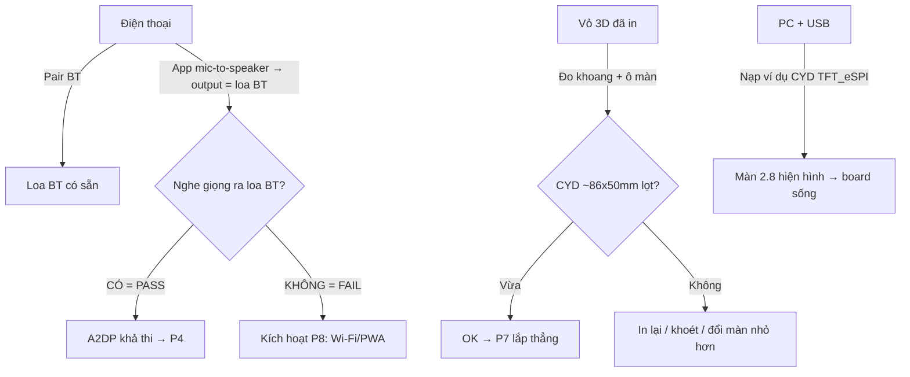

# Phase 01 — Chuẩn bị: verify A2DP, đo vừa vỏ 3D, mua đồ, cài IDE, nạp ví dụ CYD

## 1. Context links
- Plan cha: [plan.md](./plan.md)
- Dependencies: KHÔNG có. Phase này **chặn tất cả** phase sau.
- Research: [researcher-02](./research/researcher-02-audio-phone-streaming.md) (A2DP), [researcher-03](./research/researcher-03-esp32-board-tich-hop-man-hinh-loa.md) (board CYD — *lưu ý report này SAI pinout, dùng PINS.md chính thức bên dưới*)
- Nguồn pinout ĐÃ VERIFY: https://github.com/witnessmenow/ESP32-Cheap-Yellow-Display/blob/main/PINS.md
- Thư viện sẽ cài (P2-P4): `TFT_eSPI`, `ESP32-A2DP`, `ESP8266Audio`

## 2. Overview
- **Date:** 2026-07-10
- **Mô tả:** Trước khi tiêu tiền/lắp ráp, VERIFY 2 rủi ro chặn dự án: (1) điện thoại route mic→loa Bluetooth được không (dùng loa BT bất kỳ, không cần linh kiện), (2) **board CYD có lọt vỏ 3D user đã in không**. Sau đó mua đồ, cài IDE, nạp ví dụ CYD để chắc board + màn sống.
- **Priority:** P1
- **Implementation status:** pending
- **Review status:** chưa review

## 3. Key Insights
- **2 rủi ro lớn nhất KHÔNG phải code** mà là: (a) app mic-to-speaker có route sang loa BT không (iOS hạn chế hơn Android); (b) CYD có vừa khoang vỏ 3D đã in không (user chưa đo).
- Verify (a) chỉ cần **1 loa Bluetooth thường** — robot cũng chỉ là 1 loa BT.
- Verify (b) rẻ: đo thước kẹp/thước kẻ, so với PCB CYD **~86×50mm** (dày hơn ở chỗ màn + đầu USB) và vùng hiển thị 2.8" **~43×58mm** (cần verify bằng board thật khi có).
- CYD = ESP32-WROOM-32 (có BT Classic → A2DP OK). **Core Arduino-ESP32 2.0.17** (nhánh 2.0.x cuối), KHÔNG dùng 3.x (đổi API I2S gây lỗi với ESP32-A2DP/ESP8266Audio).
- CYD có **User_Setup TFT_eSPI sẵn** trong repo witnessmenow → dùng lại, không tự gõ pinout màn.

## 4. Requirements
**Functional**
- Kết luận PASS/FAIL cho mic-to-speaker route sang loa BT.
- Kết luận CYD vừa/không vừa vỏ 3D; nếu không, có phương án (in lại/khoét/đổi màn).
- IDE cài xong, nạp được 1 ví dụ CYD (hiện chữ/hình lên màn 2.8").

**Non-functional**
- Không hàn. Chỉ cắm USB. Ghi lại chi phí thực tế đối chiếu ≤ 600k.

## 5. Architecture



## 6. Related code files
- **Tạo:** `firmware/platformio.ini` — env CYD (`board = esp32dev`, core 2.0.x), chưa cần lib nặng.
- **Tạo:** `firmware/src/main-cyd-selftest.cpp` — điền màn RED/GREEN/BLUE + in `ESP.getFreeHeap()` ra Serial (< 40 dòng).
- Không sửa/xoá gì (greenfield).

## 7. Implementation Steps

**A. VERIFY mic-to-speaker (làm TRƯỚC, không cần mua gì)**
1. Pair điện thoại với 1 loa Bluetooth bất kỳ; phát nhạc để chắc pairing OK.
2. Cài app mic-to-speaker: Android — "Mic to Speaker", "Live Microphone", WO Mic; iOS — "Megaphone", "Microphone Live". Ưu tiên app cho chọn output device.
3. Đặt output = loa BT. Nói vào mic điện thoại → **nghe ra loa BT?**
   - CÓ → PASS, ghi tên app. Bỏ P8.
   - KHÔNG → thử 2-3 app; vẫn fail (thường iOS) → **làm P8 thay P4**.

**B. VERIFY vừa vỏ 3D (khi có board, hoặc đo tạm theo datasheet)**
4. Đo khoang trong vỏ 3D đã in + ô cắt cho màn.
5. So với CYD: PCB ~86×50mm; vùng hiển thị ~43×58mm; chú ý độ dày (màn + jack USB bên hông). Cần chừa lối cáp USB.
6. Nếu KHÔNG vừa → chọn: (i) khoét rộng ô/khoang, (ii) in lại vỏ theo kích thước CYD thật, (iii) đổi sang màn rời nhỏ hơn (đổi kiến trúc — báo lại coordinator).

**C. CHỐT BOM & MUA (bảng ở plan.md)**
7. Verify giá Shopee/Hshop.vn/Icdayroi. CYD ~200-300k (KHÔNG dùng số 380-450k của report). Giữ tổng ≤ 600k.
8. Mua **CYD + loa nhỏ có giắc JST 1.25 2-pin** (cắm cổng SPEAK, không hàn) + cáp micro-USB **truyền dữ liệu**. **HỎI SHOP có tặng kèm loa + dây JST không** (nhiều shop CYD có kèm). KHÔNG mua MAX98357A/jumper 2.54mm cho v1 (cổng CYD là PicoBlade 1.25mm, jumper thường không vừa; MAX98357A cần hàn — chỉ ở nâng cấp).
9. Nên mua **đồng hồ vạn năng** (đo nguồn 3.3V/5V trước khi cắm gì). Kiểm tên board đúng "ESP32-2432S028R" / "Cheap Yellow Display" bản cảm ứng điện trở.

**D. CÀI IDE & NẠP VÍ DỤ CYD**
10. Cài VS Code + **PlatformIO** (khuyến nghị, pin version lib). Hoặc Arduino IDE 2.x + esp32 core 2.0.17.
11. `platformio.ini`:
```ini
[env:cyd]
platform = espressif32 @ 6.5.0   ; core Arduino-ESP32 2.0.x (verify)
board = esp32dev
framework = arduino
monitor_speed = 115200
```
12. Lấy User_Setup CYD cho TFT_eSPI từ repo witnessmenow (thư mục `DIsplay/TFT_eSPI/`), hoặc để P2 cấu hình build_flags.
13. `main-cyd-selftest.cpp`: init TFT, `tft.fillScreen(TFT_RED)` → delay → GREEN → BLUE; `Serial.println(ESP.getFreeHeap())`.
14. Cắm CYD qua cáp micro-USB **data** (không phải cáp chỉ sạc). Cài driver CP210x/CH340 nếu Windows không nhận COM.
15. Upload. Nếu kẹt "Connecting..." → giữ nút BOOT khi nạp.
16. Màn đổi màu + Serial in free heap (~250-290KB lúc chưa bật BT) = board + màn sống.
17. **Nạp thêm 1 ví dụ CẢM ỨNG CYD** (touch example repo witnessmenow): chạm màn in toạ độ ra Serial → xác nhận XPT2046 (cảm ứng) chạy TRƯỚC khi động vào audio (vì audio DAC nội có thể xung đột GPIO25 cảm ứng ở P3).

## 8. Todo list
- [ ] Verify mic-to-speaker route loa BT (PASS/FAIL + tên app)
- [ ] Đo vỏ 3D vs CYD (vừa/không + phương án)
- [ ] Verify giá, chốt BOM ≤ 600k, mua đồ (CYD + loa JST 1.25 + cáp USB data); hỏi shop kèm loa/dây JST
- [ ] Cài PlatformIO/Arduino IDE + core 2.0.17 + driver USB
- [ ] Nạp self-test: màn đổi màu + in free heap
- [ ] Nạp ví dụ cảm ứng CYD: chạm màn in toạ độ (XPT2046 sống)

## 9. Success Criteria
- Có kết luận PASS/FAIL mic-to-speaker (biết trước có làm P8 không).
- Có kết luận CYD vừa vỏ 3D (+ phương án nếu không).
- Hoá đơn thực tế ≤ 600k.
- Màn CYD hiện màu + Serial in free heap → toolchain + phần cứng OK.

## 10. Risk Assessment
| Rủi ro | Ảnh hưởng | Giảm thiểu |
|--------|-----------|-----------|
| iOS không route mic→BT | Đường A2DP fail | Verify sớm; fail → P8 |
| CYD không lọt vỏ 3D | Không lắp được | Đo sớm; khoét/in lại/đổi màn |
| Mua nhầm bản CYD khác (S3, không cảm ứng...) | Sai pinout/thiếu tính năng | Kiểm mã "2432S028R" |
| Cáp USB chỉ sạc / thiếu driver | Không nạp được | Cáp data + driver CP210x/CH340 |
| Kẹt "Connecting..." | Không nạp | Giữ nút BOOT khi nạp |

## 11. Security Considerations
- Chưa bật BT/Wi-Fi → không có bề mặt tấn công. Chỉ lưu ý: không cài app mic-to-speaker lạ đòi quyền quá mức.

## 12. Next steps
- PASS + vừa vỏ → P2 (mắt), giữ P4 (A2DP).
- FAIL mic-to-speaker → thay P4 bằng P8.
- Không vừa vỏ → xử lý vỏ trước khi tới P7.

## Câu hỏi chưa giải đáp
- Model/OS điện thoại user? Có sẵn loa BT để verify? Có sẵn củ sạc 5V ≥1A + cáp micro-USB data?
- Kích thước khoang vỏ 3D thực tế (user cung cấp số đo)?
