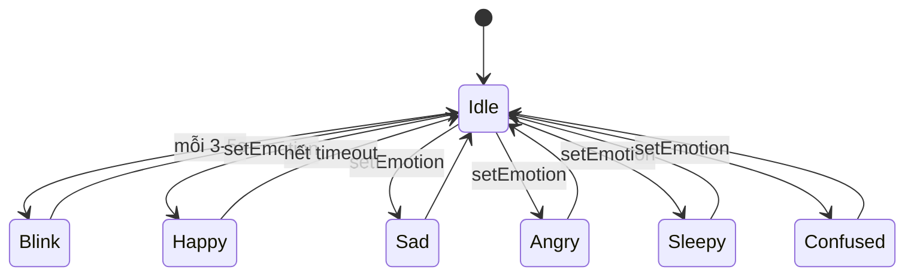

# Phase 02 — Màn CYD + 2 mắt biểu cảm (TFT_eSPI, 2 sprite mắt, đo heap)

## 1. Context links
- Plan cha: [plan.md](./plan.md) | Trước: [phase-01](./phase-01-chuan-bi-verify-a2dp-mua-linh-kien-cai-ide.md)
- Dependencies: cần P1 (board+màn sống). Chặn: P5 (lip-sync), P6 (sensor trigger cảm xúc).
- Research: [researcher-01](./research/researcher-01-display-face-animation.md), [researcher-03](./research/researcher-03-esp32-board-tich-hop-man-hinh-loa.md)
- Thư viện/pinout: `TFT_eSPI` (Bodmer) · User_Setup CYD + PINS.md: https://github.com/witnessmenow/ESP32-Cheap-Yellow-Display · `FluxGarage/RoboEyes` (tham khảo ý tưởng vẽ)

## 2. Overview
- **Date:** 2026-07-10
- **Mô tả:** Hiện 2 mắt biểu cảm kiểu EMO trên màn CYD ILI9341 320x240 (nằm ngang). Vì WROOM KHÔNG PSRAM và BT ăn RAM → KHÔNG buffer full-screen; vẽ mỗi mắt vào **1 sprite nhỏ** rồi đẩy đúng vị trí (double-buffer từng mắt → không nháy, tốn ít RAM). State machine cảm xúc: idle/blink/happy/sad/angry/sleepy/confused.
- **Priority:** P1 (mặt là cốt lõi)
- **Implementation status:** pending
- **Review status:** chưa review

## 3. Key Insights
- **RoboEyes gốc viết cho OLED SSD1306 (gọi `clearDisplay()/display()`) → KHÔNG drop-in TFT màu.** → tự viết module vẽ mắt gọn (lấy ý tưởng RoboEyes) trên TFT_eSPI.
- **Điểm khó nhất = RAM.** WROOM-32 ~320KB DRAM, sau BT Classic còn **~160KB** (verify bằng `ESP.getFreeHeap()`). Sprite full 320×240 RGB565 = 320×240×2 = **150KB → KHÔNG khả thi** khi BT chạy.
  - **CHỐT: 2 sprite nhỏ, mỗi sprite bao 1 mắt.** Ví dụ 100×100 RGB565 = 100×100×2 = **20KB/mắt → 2 mắt = 40KB.** Còn dư nhiều RAM cho BT. Nền đen vẽ 1 lần bằng `tft.fillScreen(TFT_BLACK)`, chỉ push 2 sprite mắt mỗi khung.
  - Fallback nếu vẫn thiếu RAM: vẽ trực tiếp lên TFT với "dirty-rect" (xoá đúng ô mắt cũ + vẽ mắt mới) — 0 buffer, hơi nháy nhẹ.
- CYD dùng **HSPI cho màn** (tách khỏi audio DAC nội GPIO26 và cảm ứng). Có **User_Setup CYD sẵn** → dùng lại, ít lỗi cấu hình.
- Non-blocking: dùng `millis()`, KHÔNG `delay()` trong vòng animation. FPS mục tiêu 25-30.

## 4. Requirements
**Functional**
- Hiện 2 mắt tĩnh → blink tự động (3-5s, ~150ms) → 7 cảm xúc qua `setEmotion()`.
**Non-functional**
- Không nháy vùng mắt (sprite/mắt double-buffer). Không blocking.
- Tổng RAM sprite ≤ ~45KB (giữ chỗ cho BT). In free heap để kiểm chứng.
- Module code < 200 dòng/file.

## 5. Architecture

**Pinout màn CYD ILI9341 (HSPI) — ĐÃ VERIFY (PINS.md witnessmenow), KHÔNG tự đổi:**

| Khối | Chân |
|------|------|
| TFT CS | IO15 |
| TFT MOSI | IO13 |
| TFT SCLK | IO14 |
| TFT MISO | IO12 |
| TFT DC | IO2 |
| TFT Backlight | IO21 |

> Người mới: KHÔNG cần nối gì cho màn (đã hàn sẵn trên CYD). Chỉ cần cấu hình TFT_eSPI đúng board. Tránh GPIO 6-11 (flash), IO34-39 (input-only).

**State machine cảm xúc:**


## 6. Related code files
- **Tạo:** `firmware/src/display/robo-eyes-tft.h` — class `RoboEyesTFT` (enum Emotion, API `begin/setEmotion/update`).
- **Tạo:** `firmware/src/display/robo-eyes-tft.cpp` — 2 sprite mắt, blink, easing, state machine (< 200 dòng; tách `robo-eyes-emotions.cpp` nếu quá).
- **Tạo:** `firmware/src/main.cpp` — init TFT + `eyes.update()` trong loop (tạm; chuyển task ở P5).
- **Sửa:** `firmware/platformio.ini` — thêm TFT_eSPI + build_flags cấu hình CYD.

## 7. Implementation Steps

**A. Cấu hình TFT_eSPI cho CYD (qua build_flags → không sửa file lib)**
1. `platformio.ini`:
```ini
lib_deps = bodmer/TFT_eSPI @ ^2.5.43
build_flags =
    -DUSER_SETUP_LOADED=1
    -DILI9341_2_DRIVER=1
    -DTFT_WIDTH=240
    -DTFT_HEIGHT=320
    -DTFT_MISO=12
    -DTFT_MOSI=13
    -DTFT_SCLK=14
    -DTFT_CS=15
    -DTFT_DC=2
    -DTFT_RST=-1
    -DTFT_BL=21
    -DTFT_BACKLIGHT_ON=HIGH
    -DLOAD_GLCD=1
    -DSPI_FREQUENCY=55000000
    -DUSE_HSPI_PORT=1
```
> Đây là cấu hình CYD phổ biến — **cần verify với User_Setup của repo witnessmenow** (một số lô CYD dùng `ST7789`/màu đảo → nếu sai màu thêm `-DTFT_INVERSION_ON=1`).

**B. Test màn (đã làm ở P1) → xoay ngang**
2. `tft.init(); tft.setRotation(1);` (ngang 320×240). `fillScreen(TFT_BLACK)`.

**C. Vẽ mắt bằng 2 sprite nhỏ**
3. Tạo 2 sprite mắt (1 lần trong `begin`):
```cpp
TFT_eSPI tft;
TFT_eSprite eyeL = TFT_eSprite(&tft);
TFT_eSprite eyeR = TFT_eSprite(&tft);
const int EW = 100, EH = 100;   // 100x100 = 20KB/sprite
void beginEyes() {
  tft.init(); tft.setRotation(1); tft.fillScreen(TFT_BLACK);
  eyeL.setColorDepth(16); eyeR.setColorDepth(16);
  eyeL.createSprite(EW, EH); eyeR.createSprite(EW, EH);
  Serial.printf("freeHeap sau sprite: %u\n", ESP.getFreeHeap());  // KIỂM CHỨNG
}
```
4. Vẽ 1 mắt vào sprite (ý tưởng RoboEyes: chữ nhật bo góc; blink = giảm chiều cao; mood = che góc bằng tam giác/chữ nhật đen):
```cpp
void drawEye(TFT_eSprite &sp, int h, Emotion mood) {
  sp.fillSprite(TFT_BLACK);
  int w = 80, x = (EW-w)/2, y = (EH-h)/2;
  sp.fillSmoothRoundRect(x, y, w, h, 18, TFT_CYAN);
  if (mood==HAPPY){ sp.fillRect(x, y+h/2, w, h/2, TFT_BLACK); }      // cong cười
  if (mood==ANGRY){ sp.fillTriangle(x, y, x+w, y, x+w, y+22, TFT_BLACK); } // cau (mắt phải đảo)
  // SAD: nghiêng ngược ANGRY; SLEEPY: h nhỏ; CONFUSED: 2 mắt h khác nhau
}
void pushEyes(int h, Emotion m){ drawEye(eyeL,h,m); drawEye(eyeR,h,m);
  eyeL.pushSprite(50,70); eyeR.pushSprite(170,70); }   // vị trí 2 mắt ngang
```
5. Blink non-blocking: `millis()`, giảm `h` 90→8→90 trong ~150ms mỗi 3-5s.
6. `update()` gọi ~40ms/lần (25 FPS): cập nhật blink + timeout cảm xúc + `pushEyes`.

**D. Kiểm chứng RAM**
7. In `ESP.getFreeHeap()` sau khi tạo sprite. Ở P5 khi thêm A2DP, in lại để chắc không âm/crash. Nếu heap thấp nguy hiểm → giảm sprite còn 90×90 (16KB/mắt) hoặc dùng dirty-rect direct-draw.

## 8. Todo list
- [ ] platformio.ini: TFT_eSPI + build_flags CYD (verify User_Setup witnessmenow)
- [ ] setRotation(1), fillScreen đen, test hiển thị
- [ ] 2 sprite mắt 100×100, in free heap
- [ ] Vẽ 2 mắt tĩnh, push đúng vị trí ngang
- [ ] Blink non-blocking
- [ ] 7 emotion state machine
- [ ] Tách file robo-eyes-tft.* < 200 dòng

## 9. Success Criteria
- Màn hiện 2 mắt màu ngang, blink đều, chuyển đủ 7 cảm xúc.
- FPS ≥ 25 (đếm khung in Serial), không nháy vùng mắt.
- `ESP.getFreeHeap()` sau sprite còn dư an toàn (đủ chỗ cho BT ở P5).

## 10. Risk Assessment
| Rủi ro | Ảnh hưởng | Giảm thiểu |
|--------|-----------|-----------|
| Sprite full-screen → hết RAM | Crash khi thêm BT | Chỉ 2 sprite nhỏ 100×100 = 40KB; in heap kiểm chứng |
| Sai màu/đảo màu (lô CYD khác) | Hiển thị xấu | Thêm `TFT_INVERSION_ON`/đổi driver ST7789 |
| Cấu hình TFT_eSPI sai chân | Màn trắng/không lên | Dùng đúng User_Setup CYD (PINS.md) |
| Nháy nếu chuyển sang direct-draw | Xấu | Dirty-rect chỉ xoá ô mắt cũ, không cả màn |
| delay() trong animation | Giật, chặn | Chỉ dùng millis() |

## 11. Security Considerations
- Không mạng → không bề mặt tấn công. An toàn điện: màn đã hàn sẵn trên CYD, không cắm nhầm nguồn.

## 12. Next steps
- P3 (audio) độc lập; hoặc P6 (sensor) vì đã có state machine.
- Giữ API `setEmotion()` + biến `audioLevel` để P5 hook lip-sync.

## Câu hỏi chưa giải đáp
- Lô CYD của user dùng ILI9341 hay ST7789? Có cần `TFT_INVERSION_ON` không? → thử thực tế.
- Kích thước/vị trí 2 mắt hợp thẩm mỹ EMO (tinh chỉnh sau khi thấy màn thật).
