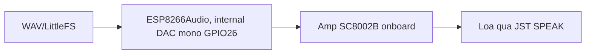

# Phase 03 — Âm thanh qua loa onboard + DAC nội, phát WAV từ LittleFS

## 1. Context links
- Plan cha: [plan.md](./plan.md) | Trước: [phase-02](./phase-02-man-hinh-tft-mat-bieu-cam-sprite.md)
- Dependencies: cần P1. Độc lập P2. Chặn gián tiếp P4/P5.
- Research: [researcher-02](./research/researcher-02-audio-phone-streaming.md), [researcher-03](./research/researcher-03-esp32-board-tich-hop-man-hinh-loa.md) (DAC nội CYD 8-bit — *report này SAI ở pinout/giá, đã đính chính*)
- Pinout ĐÃ VERIFY: PINS.md witnessmenow · Thư viện: `ESP8266Audio` (earlephilhower) · SC8002B datasheet

## 2. Overview
- **Date:** 2026-07-10
- **Mô tả:** Cấp tiếng cho robot bằng **loa onboard CYD** (cắm cổng JST "SPEAK"), qua amp SC8002B, driven bởi **DAC nội ESP32 (GPIO26)**. Test phát WAV từ LittleFS. **KHÔNG dùng MAX98357A/I2S ở v1** (không hàn được — xem lý do §3).
- **Priority:** P1
- **Implementation status:** pending
- **Review status:** chưa review

## 3. Key Insights
- **TẠI SAO bỏ MAX98357A/I2S ở v1 (KHẢ THI VẬT LÝ):** I2S cần 3 chân output. Trên CYD, chân output truy cập được KHÔNG hàn chỉ có **IO22 + IO27** (IO35 input-only, IO21 backlight). **IO26 KHÔNG lộ ra cổng nào** — chạy thẳng vào amp SC8002B trong bo, muốn lấy phải HÀN. User chưa hàn → chỉ 2 chân → **không đủ cho I2S**. → v1 dùng DAC nội + loa onboard.
- **⚠️ CẠM BẪY DAC vs CẢM ỨNG (bug rất khó tự tìm — PHẢI ghi):** DAC nội ESP32 có 2 kênh: **DAC1=GPIO25, DAC2=GPIO26**. Mà **GPIO25 = CLK của cảm ứng XPT2046**. Nếu bật DAC stereo/cả 2 kênh → GPIO25 bị chiếm → **CẢM ỨNG MÀN CHẾT** (phá P6). → **BẮT BUỘC cấu hình chỉ bật kênh GPIO26 (mono), KHÔNG động GPIO25.** Verify bằng cách chạm màn khi đang phát nhạc (P6).
- **Chất âm 8-bit:** DAC nội → nhiễu nền, KHÔNG hi-fi. Đủ cho giọng nói + nhạc nhẹ để bàn. User muốn "nghe nhạc tử tế" → v1 chưa đạt; nâng cấp I2S 16-bit cần hàn (xem §12).
- Giảm nhiễu: giảm âm lượng nguồn/gain tránh clipping; file WAV chuẩn 16-bit sẽ được hạ xuống 8-bit khi ra DAC.
- File audio: WAV PCM 16-bit mono 16kHz cho nhẹ LittleFS (YAGNI).

## 4. Requirements
**Functional**
- Phát WAV từ LittleFS ra loa onboard nghe rõ.
- Hàm `playWav(path)` gọi lại nhiều lần OK.
- **Cảm ứng vẫn sống khi phát nhạc** (không chiếm GPIO25).
**Non-functional**
- Không hàn. Chấp nhận chất âm 8-bit ở v1. Module audio < 200 dòng.e

## 5. Architecture

**Đường tín hiệu (KHÔNG có module ngoài, KHÔNG nối dây tín hiệu):**

| Khối | Chân/cổng | Ghi chú |
|------|-----------|---------|
| DAC nội kênh 2 | GPIO26 | Chỉ bật kênh này (mono) — TRÁNH GPIO25 |
| Amp onboard | SC8002B | Có sẵn trên CYD |
| Loa | cổng JST "SPEAK" 2-pin | Cắm loa vào đây (KHÔNG cần hàn) |



## 6. Related code files
- **Tạo:** `firmware/src/audio/audio-player-dac.h` / `.cpp` — `beginAudio/playWav/audioLoop`, cấu hình **internal DAC kênh GPIO26 mono** (< 200 dòng).
- **Tạo:** `firmware/data/hello.wav` — WAV 16-bit mono 16kHz.
- **Sửa:** `firmware/platformio.ini` — ESP8266Audio + `board_build.filesystem = littlefs`.
- **Sửa:** `firmware/src/main.cpp` — gọi `playWav` test.

## 7. Implementation Steps

**A. Loa (không hàn, không dây tín hiệu)**
1. Cắm loa vào **cổng JST "SPEAK"** trên CYD. (Nhiều shop tặng kèm loa + giắc JST — hỏi trước khi mua, xem P1.)

**B. Thư viện + filesystem**
2. `platformio.ini`:
```ini
lib_deps =
    bodmer/TFT_eSPI @ ^2.5.43
    earlephilhower/ESP8266Audio @ ^1.9.7
board_build.filesystem = littlefs
```
3. Tạo `data/hello.wav` (Audacity 16-bit PCM mono 16000Hz; hoặc ffmpeg: `ffmpeg -i in.mp3 -ac 1 -ar 16000 -sample_fmt s16 hello.wav`).
4. PlatformIO → **Upload Filesystem Image**.

**C. Code phát WAV ra DAC nội (CHỈ kênh GPIO26)**
5. `audio-player-dac.cpp`:
```cpp
#include <LittleFS.h>
#include <AudioGeneratorWAV.h>
#include <AudioFileSourceLittleFS.h>
#include <AudioOutputI2S.h>
#include <driver/i2s.h>
static AudioGeneratorWAV *wav; static AudioFileSourceLittleFS *file; static AudioOutputI2S *out;
void beginAudio(){
  LittleFS.begin();
  out = new AudioOutputI2S(0, AudioOutputI2S::INTERNAL_DAC); // dùng DAC built-in
  // ⚠️ Chỉ bật kênh DAC nối GPIO26, KHÔNG bật GPIO25 (cảm ứng). VERIFY chiều kênh:
  i2s_set_dac_mode(I2S_DAC_CHANNEL_LEFT_EN);   // LEFT_EN↔GPIO26 (cần verify bằng test chạm màn)
  out->SetGain(0.4);                            // thấp để tránh clipping/nhiễu 8-bit
}
void playWav(const char* p){
  if (wav && wav->isRunning()) wav->stop();
  file = new AudioFileSourceLittleFS(p);
  wav = new AudioGeneratorWAV(); wav->begin(file, out);
}
void audioLoop(){ if (wav && wav->isRunning()){ if(!wav->loop()) wav->stop(); } }
```
6. `main.cpp`: `beginAudio(); playWav("/hello.wav");` + `audioLoop()` trong loop.
7. Nạp → nghe loa. Chỉnh `SetGain` 0.3-0.6 (cao quá → rè/clipping 8-bit).
8. **TEST XUNG ĐỘT CẢM ỨNG:** trong khi phát nhạc, chạm màn (nếu đã có P6) → cảm ứng còn chạy? Nếu chết → `i2s_set_dac_mode` đang bật nhầm GPIO25; đổi sang `I2S_DAC_CHANNEL_RIGHT_EN` và test lại (chiều LEFT/RIGHT ↔ 25/26 khác nhau tuỳ core, phải thử thực tế).

## 8. Todo list
- [ ] Cắm loa vào JST SPEAK (hỏi shop có kèm loa/giắc)
- [ ] platformio.ini: ESP8266Audio + littlefs
- [ ] Tạo hello.wav, upload filesystem
- [ ] Code audio-player-dac.* — internal DAC, CHỈ kênh GPIO26 mono
- [ ] Phát thử, chỉnh gain tránh clipping
- [ ] Test cảm ứng còn sống khi phát nhạc (chiều kênh DAC đúng)

## 9. Success Criteria
- Loa onboard phát WAV nghe rõ (chấp nhận chất âm 8-bit).
- `playWav` gọi lại nhiều lần OK.
- **Cảm ứng XPT2046 vẫn hoạt động khi đang phát nhạc** (không chiếm GPIO25).

## 10. Risk Assessment
| Rủi ro | Ảnh hưởng | Giảm thiểu |
|--------|-----------|-----------|
| DAC bật cả 2 kênh → chiếm GPIO25 | **Cảm ứng chết** | `i2s_set_dac_mode` 1 kênh (GPIO26); test chạm khi phát nhạc; đảo LEFT/RIGHT nếu sai |
| Gain cao → clipping 8-bit | Rè, méo | SetGain 0.3-0.6; nguồn audio không max volume |
| Kỳ vọng "nhạc tử tế" vs 8-bit | User thất vọng | Nêu rõ giới hạn; đường nâng cấp §12 |
| WAV sai định dạng | Không phát | Ép 16-bit mono 16kHz |
| Sụt áp khi loa to | Reset | Tụ 1000µF (P7), củ sạc ≥1A |

## 11. Security Considerations
- Không mạng → không rủi ro mạng. An toàn điện: loa cắm cổng JST có sẵn, không nối nguồn ngoài → rủi ro thấp.

## 12. Next steps
- P4: đổi nguồn audio từ file → A2DP (dùng lại DAC nội qua `AnalogAudioStream`).
- P5: lấy mức âm lượng để nhấp mắt (lip-sync).

### Nâng cấp audio 16-bit (TUỲ CHỌN — không có ở v1)
User muốn "nghe nhạc tử tế" → DAC 8-bit không đạt. 3 đường nâng cấp (làm SAU khi nghe thử v1):
1. **Hàn 3 dây** lên bo lấy chân cho I2S + **MAX98357A** → 16-bit sạch. Cần học hàn (~75-110k linh kiện: MAX98357A + loa 3W).
2. **Breakout/sniffer khe thẻ SD** mượn IO5/18/19/23 cho I2S → không hàn, nhưng khó kiếm ở VN, **mất khe SD**.
3. **Đổi board**: ESP32 DevKit rời + ST7789 rời + MAX98357A (toàn header 2.54mm, cắm jumper thoải mái) — nhưng **vỏ 3D đã in có thể không vừa**.
→ Khuyến nghị: **làm v1 bằng DAC nội trước, nghe thử rồi mới quyết.** (YAGNI)

## Câu hỏi chưa giải đáp
- Loa kèm CYD có sẵn không, mấy W/Ω (SC8002B ~3W/4Ω, cần verify)?
- Chiều kênh DAC LEFT/RIGHT ↔ GPIO25/26 trên core của user? → test chạm màn khi phát nhạc.
