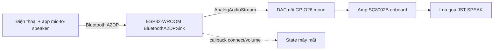

# Phase 04 — Bluetooth A2DP sink: điện thoại → robot phát (app mic-to-speaker)

## 1. Context links
- Plan cha: [plan.md](./plan.md) | Trước: [phase-03](./phase-03-am-thanh-loa-onboard-dac-noi-phat-wav.md)
- Dependencies: cần P1 (verify A2DP PASS) + P3 (loa onboard + DAC nội chạy). Chặn: P5 (lip-sync lấy PCM từ A2DP).
- **Nếu P1 verify FAIL → BỎ QUA phase này, làm [phase-08](./phase-08-optional-fallback-wifi-udp-websocket-pwa.md).**
- Research: [researcher-02](./research/researcher-02-audio-phone-streaming.md), [researcher-03](./research/researcher-03-esp32-board-tich-hop-man-hinh-loa.md) (snippet `AnalogAudioStream` trong report này ĐÚNG cho v1)
- Thư viện: `pschatzmann/ESP32-A2DP` https://github.com/pschatzmann/ESP32-A2DP

## 2. Overview
- **Date:** 2026-07-10
- **Mô tả:** Biến robot (CYD) thành 1 loa Bluetooth (A2DP sink). Điện thoại pair "EMO-Robot", chạy app mic-to-speaker → nói vào mic điện thoại, robot phát ra loa onboard (voice-through). **Xuất ra DAC nội bằng `AnalogAudioStream`, KHÔNG dùng I2S/MAX98357A** (v1 không hàn được — xem P3).
- **Priority:** P1 (đường audio chính)
- **Implementation status:** pending
- **Review status:** chưa review

## 3. Key Insights
- CYD = **ESP32-WROOM-32 có BT Classic** → A2DP sink chạy được (examples pschatzmann chạy trên WROOM không PSRAM).
- **Xuất DAC nội bằng `AnalogAudioStream`** của arduino-audio-tools (đúng như snippet researcher-03): `AnalogAudioStream out; BluetoothA2DPSink a2dp_sink(out);`. Không cấu hình I2S pin ngoài.
- **⚠️ DAC vs CẢM ỨNG:** DAC nội có DAC1=GPIO25 (=CLK cảm ứng XPT2046) và DAC2=GPIO26 (=amp onboard). **Phải cấu hình chỉ bật kênh GPIO26 (mono)**, nếu không **cảm ứng chết**. Verify bằng chạm màn khi A2DP đang phát (P6).
- **Wi-Fi + BT coexistence**: cùng radio 2.4GHz → **tắt Wi-Fi khi A2DP** (`WiFi.mode(WIFI_OFF)`).
- **Core Arduino-ESP32 2.0.17** (khớp API của ESP32-A2DP + audio-tools).
- **Chất âm 8-bit DAC nội** → nhiễu, hợp giọng nói/nhạc nhẹ; nâng cấp 16-bit cần hàn (P3 §12).
- **RAM:** BT ăn nhiều → giữ sprite mắt nhỏ (P2). In `ESP.getFreeHeap()` sau `a2dp.start()`.

## 4. Requirements
**Functional**
- Điện thoại thấy "EMO-Robot", pair + kết nối; phát nhạc/giọng ra loa onboard.
- Callback trạng thái kết nối (mắt "happy" khi connect).
- **Cảm ứng vẫn sống khi A2DP phát** (chỉ bật kênh GPIO26).
**Non-functional**
- Wi-Fi tắt khi A2DP. Latency ~200-300ms (chấp nhận voice-through). Không rè khi mắt render (P5 chia core).

## 5. Architecture


## 6. Related code files
- **Tạo:** `firmware/src/audio/bluetooth-a2dp-sink.h` / `.cpp` — BluetoothA2DPSink + AnalogAudioStream + cấu hình DAC 1 kênh (< 120 dòng).
- **Sửa:** `firmware/platformio.ini` — thêm ESP32-A2DP (+ arduino-audio-tools nếu cần AnalogAudioStream).
- **Sửa:** `firmware/src/main.cpp` — chế độ A2DP; tắt Wi-Fi.
- **Tạo (docs):** `firmware/docs/huong-dan-app-mic-to-speaker.md`.

## 7. Implementation Steps

**A. Thư viện**
1. `platformio.ini` `lib_deps` thêm `pschatzmann/ESP32-A2DP @ ^1.8.3` (và `pschatzmann/arduino-audio-tools` nếu dùng `AnalogAudioStream`; verify bản mới).

**B. A2DP sink xuất DAC nội (KHÔNG I2S)**
2. `bluetooth-a2dp-sink.cpp`:
```cpp
#include "AudioTools.h"
#include "BluetoothA2DPSink.h"
#include <driver/i2s.h>
AnalogAudioStream out;                 // DAC built-in (GPIO25/26)
BluetoothA2DPSink a2dp_sink(out);
void beginA2DP(const char* name){
  a2dp_sink.set_on_connection_state_changed([](esp_a2d_connection_state_t s, void*){
    // CONNECTED → mắt "happy" (P5)
  });
  a2dp_sink.start(name);               // "EMO-Robot"
  // ⚠️ chỉ bật kênh DAC nối GPIO26 để không chiếm GPIO25 (cảm ứng):
  i2s_set_dac_mode(I2S_DAC_CHANNEL_LEFT_EN);  // verify chiều LEFT↔GPIO26 bằng test chạm
  Serial.printf("freeHeap sau A2DP: %u\n", ESP.getFreeHeap());
}
```
3. `main.cpp` setup: `WiFi.mode(WIFI_OFF); beginA2DP("EMO-Robot");` — KHÔNG chạy audioLoop (P3) khi A2DP.

**C. Kết nối + app mic-to-speaker**
4. Điện thoại → Bluetooth → "EMO-Robot" → pair. Phát nhạc → ra loa onboard = A2DP OK.
5. Mở app mic-to-speaker (đã xác định P1), output = "EMO-Robot", nói vào mic → nghe ra loa robot.
6. Viết `huong-dan-app-mic-to-speaker.md` (bước 4-5 + tên app PASS ở P1).

**D. Test xung đột cảm ứng**
7. Khi A2DP đang phát, chạm màn → cảm ứng còn chạy? Nếu chết → đổi `i2s_set_dac_mode` sang `RIGHT_EN` và test lại.

## 8. Todo list
- [ ] platformio.ini: ESP32-A2DP (+ audio-tools)
- [ ] Code A2DP → AnalogAudioStream/DAC nội, 1 kênh GPIO26 (KHÔNG I2S)
- [ ] Tắt Wi-Fi ở chế độ A2DP
- [ ] Pair "EMO-Robot", phát nhạc ra loa onboard
- [ ] App mic-to-speaker → voice-through chạy
- [ ] In free heap; callback connect chuẩn bị hook mắt
- [ ] Test cảm ứng sống khi A2DP phát
- [ ] Viết huong-dan-app-mic-to-speaker.md

## 9. Success Criteria
- Pair + phát nhạc ra loa onboard rõ.
- Nói vào mic điện thoại → nghe ra loa robot (~200-300ms trễ).
- Kết nối/ngắt lặp nhiều lần không treo; free heap dương; **cảm ứng còn sống**.

## 10. Risk Assessment
| Rủi ro | Ảnh hưởng | Giảm thiểu |
|--------|-----------|-----------|
| Dùng I2S/MAX98357A (không có ở v1) | Không gắn được | Dùng AnalogAudioStream/DAC nội |
| DAC 2 kênh → chiếm GPIO25 | Cảm ứng chết | i2s_set_dac_mode 1 kênh (GPIO26); test chạm; đảo LEFT/RIGHT nếu sai |
| Bật Wi-Fi cùng A2DP | Rè, tụt chất lượng | WiFi.mode(WIFI_OFF) |
| Render mắt làm rè audio | Voice-through xấu | Chia core (P5) |
| App iOS không route mic | Voice-through fail | Verify P1; fail → P8 |
| BT + sprite → hết heap | Crash | Sprite mắt nhỏ (P2); in free heap |

## 11. Security Considerations
- **Ai cũng pair được robot** (A2DP Just-Works, không mã hoá nội dung). Trong ~10m, ai thấy "EMO-Robot" đều có thể kết nối + phát tiếng.
- Giảm thiểu: đặt tên khó đoán; chỉ bật A2DP khi dùng; A2DP thường giữ 1 kết nối/lần (người khác phải đợi bạn ngắt). KHÔNG auth mạnh — giới hạn A2DP; đừng truyền dữ liệu nhạy cảm.

## 12. Next steps
- P5: đọc PCM trong callback A2DP → RMS → nhấp mắt + chia core FreeRTOS.
- Tích hợp P2 (mắt) + P4 (A2DP) chạy đồng thời (làm ở P5).

## Câu hỏi chưa giải đáp
- Có cần vừa A2DP vừa phát WAV cục bộ (P3) không? Nếu có → cơ chế chuyển chế độ (hiện 1 chế độ/lần).
- Latency voice-through thực tế trên điện thoại user chịu được không? → đo sau khi chạy.
