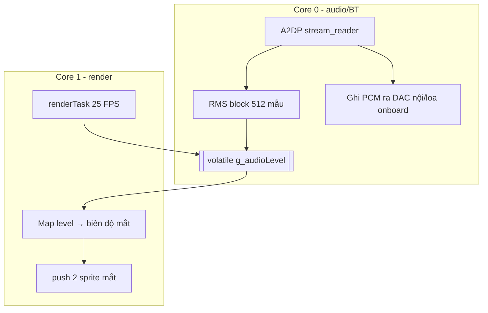

# Phase 05 — Lip-sync / phản ứng âm lượng + chia core FreeRTOS

## 1. Context links
- Plan cha: [plan.md](./plan.md) | Trước: [phase-04](./phase-04-bluetooth-a2dp-sink-nhan-audio-dien-thoai.md)
- Dependencies: **cần P2 (mắt) + P4 (A2DP)**. Phase TÍCH HỢP lớn (mắt + audio chạy cùng lúc trên WROOM ít RAM).
- Research: [researcher-02](./research/researcher-02-audio-phone-streaming.md) (lip-sync RMS/FFT trên 512-1024 mẫu)
- Tài liệu: FreeRTOS `xTaskCreatePinnedToCore`, ESP32-A2DP `set_stream_reader`

## 2. Overview
- **Date:** 2026-07-10
- **Mô tả:** Robot nhấp mắt theo âm lượng giọng nói. Lấy PCM từ callback A2DP → tính **RMS** (nhẹ hơn FFT) → map ra biên độ animation mắt. **Chia core**: core 0 lo BT/A2DP/DAC, core 1 lo render 2 sprite mắt → render không làm rè audio.
- **Priority:** P2 (tính năng "wow", không chặn audio cơ bản)
- **Implementation status:** pending
- **Review status:** chưa review

## 3. Key Insights
- **RMS đủ cho lip-sync** — không cần FFT (YAGNI). RMS trên block 512-1024 mẫu, rẻ CPU.
- **Vì sao chia core:** render TFT (push 2 sprite mắt qua HSPI) tốn vài ms; chung core với BT/audio sẽ nghẽn → **rè/giật tiếng**. ESP32 dual-core: **task audio core 0, task render core 1**. BT stack ESP-IDF chạy core 0 mặc định → render đặt core 1.
- **Chia sẻ dữ liệu 2 core:** 1 biến `volatile float g_audioLevel` (callback audio ghi, render đọc). 1 float đơn giản + low-pass → chấp nhận (KISS); cần chặt hơn thì `portMUX`/queue (chưa cần).
- **RAM WROOM căng:** đây là lúc BT + 2 sprite mắt cùng sống. In `ESP.getFreeHeap()` sau A2DP + sau sprite; nếu nguy hiểm → giảm sprite (P2) hoặc dirty-rect.
- EMO không có miệng → "lip-sync" qua **mắt**: âm lượng cao → mắt to/nảy nhẹ (hoặc thêm 1 thanh "miệng" đơn giản dao động — tuỳ chọn).

## 4. Requirements
**Functional**
- Có tiếng từ điện thoại (A2DP) → mắt phản ứng theo âm lượng gần thời gian thực.
- Callback connect (P4) → mắt "happy" khi kết nối.
**Non-functional**
- **Audio KHÔNG rè khi mắt render** (tiêu chí quan trọng nhất). Trễ phản ứng < ~150ms. Không blocking.

## 5. Architecture


## 6. Related code files
- **Tạo:** `firmware/src/audio/audio-level-rms.h` / `.cpp` — tính RMS từ buffer PCM (< 80 dòng).
- **Sửa:** `firmware/src/audio/bluetooth-a2dp-sink.cpp` — `set_stream_reader` chặn PCM tính RMS trước khi ra DAC nội.
- **Tạo:** `firmware/src/tasks/render-task.cpp` — task render pin core 1.
- **Sửa:** `firmware/src/display/robo-eyes-tft.cpp` — thêm tham số `audioLevel` modulate mắt.
- **Sửa:** `firmware/src/main.cpp` — tạo task, khởi động 2 core.

## 7. Implementation Steps

**A. Tính RMS từ PCM A2DP**
1. Đăng ký stream reader (PCM 16-bit stereo):
```cpp
volatile float g_audioLevel = 0.0f;   // 0.0 - 1.0
void read_data_stream(const uint8_t *data, uint32_t len){
  const int16_t *s = (const int16_t*)data;
  uint32_t n = len / 2; double sum = 0;
  for (uint32_t i=0; i<n; i+=2){ double v = s[i]/32768.0; sum += v*v; } // kênh trái
  float rms = sqrt(sum / (n/2 + 1));
  g_audioLevel = 0.7f*g_audioLevel + 0.3f*min(1.0f, rms*4.0f);          // low-pass
}
// trong beginA2DP(): a2dp_sink.set_stream_reader(read_data_stream, true); // true = vẫn ra DAC/loa
```

**B. Render task core 1**
2. `render-task.cpp`:
```cpp
void renderTask(void*){
  beginEyes();                                   // tạo 2 sprite mắt (P2)
  const TickType_t period = pdMS_TO_TICKS(40);   // 25 FPS
  for(;;){ float lvl = g_audioLevel; eyesUpdate(lvl); vTaskDelay(period); }
}
// main setup: A2DP start (BT task → core 0), rồi:
xTaskCreatePinnedToCore(renderTask, "render", 8192, nullptr, 1, nullptr, 1); // core 1
```
3. `eyesUpdate(lvl)`: `lvl` cao → tăng chiều cao mắt vài px (nảy) hoặc vẽ thanh miệng cao ~ `lvl*30`. Easing cho mượt.

**C. Kiểm rè + RAM**
4. Nói/nhạc qua A2DP → xem audio có rè khi mắt động mạnh không.
5. Nếu rè: tăng stack render, giảm FPS (40→50ms), hoặc bật DMA push sprite. Xác nhận render ở core 1 (`xPortGetCoreID()`).
6. In `ESP.getFreeHeap()` khi chạy đồng thời BT + sprite → chắc không cạn RAM.

## 8. Todo list
- [ ] audio-level-rms.* tính RMS
- [ ] set_stream_reader → cập nhật g_audioLevel (low-pass)
- [ ] render-task pin core 1, BT core 0
- [ ] eyesUpdate nhận audioLevel → modulate mắt
- [ ] Callback connect → setEmotion(HAPPY)
- [ ] Test: nói vào điện thoại → mắt nhấp theo, audio KHÔNG rè, heap an toàn

## 9. Success Criteria
- Nói/nhạc qua A2DP → mắt dao động theo âm lượng, trễ < ~150ms.
- **Audio không rè** khi mắt hoạt động mạnh (test 1-2 phút).
- Log xác nhận render core 1, audio callback core 0; free heap còn dương.

## 10. Risk Assessment
| Rủi ro | Ảnh hưởng | Giảm thiểu |
|--------|-----------|-----------|
| Rè audio khi render | Xấu | Chia core; DMA push; giảm FPS |
| Race g_audioLevel | Giá trị nhảy | volatile + low-pass; nặng hơn dùng queue |
| Stack overflow render | Reset | 8192 byte; theo dõi `uxTaskGetStackHighWaterMark` |
| Hết heap (BT + sprite) | Crash | Sprite mắt nhỏ (P2); in free heap; giảm size nếu cần |
| RMS quá nhạy/không nhạy | Mắt giật/không nhúc nhích | Chỉnh `rms*4.0`, low-pass 0.7/0.3 |

## 11. Security Considerations
- Kênh vẫn là A2DP (P4) → giới hạn bảo mật như P4. Không thêm bề mặt tấn công. Không log/lưu nội dung audio.

## 12. Next steps
- P6: cảm biến (chạm XPT2046 + LDR) trigger cảm xúc, dùng cùng state machine.
- Cân nhắc thêm thanh "miệng" nếu muốn giống nói chuyện hơn (tuỳ chọn).

## Câu hỏi chưa giải đáp
- Phản ứng bằng mắt (nảy/to-nhỏ) hay thêm hẳn "miệng"? → chọn theo thẩm mỹ.
- Có cần lip-sync cả khi phát WAV cục bộ (P3) không? → nếu cần, đọc mức từ buffer WAV tương tự.
