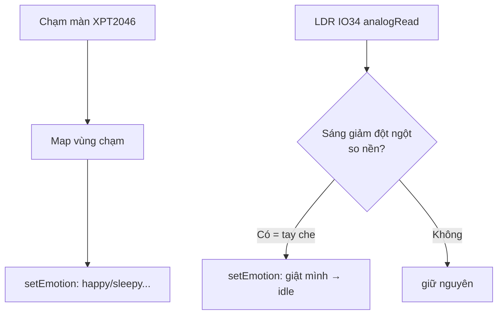

# Phase 06 — Tương tác: cảm ứng XPT2046 (chạm) + LDR (che sáng) onboard

## 1. Context links
- Plan cha: [plan.md](./plan.md) | Trước: [phase-05](./phase-05-lip-sync-phan-ung-am-luong-freertos.md)
- Dependencies: **cần P2** (state machine cảm xúc). Không cần audio.
- Pinout ĐÃ VERIFY: PINS.md witnessmenow — XPT2046 (CLK=IO25, MOSI=IO32, CS=IO33, IRQ=IO36, MISO=IO39); LDR=IO34.
- Thư viện: `PaulStoffregen/XPT2046_Touchscreen` (hoặc touch tích hợp TFT_eSPI)

## 2. Overview
- **Date:** 2026-07-10
- **Mô tả:** Cho robot phản ứng với người mà **KHÔNG cần thêm linh kiện/chân** (đã hết chân sau khi cấp I2S). Dùng 2 cảm biến CÓ SẴN trên CYD: (1) **cảm ứng điện trở XPT2046** — chạm mặt robot → đổi cảm xúc; (2) **LDR quang trở (IO34)** — đưa tay lại gần che sáng → robot "giật mình". **HC-SR04 đã LOẠI** (hết chân).
- **Priority:** P2
- **Implementation status:** pending
- **Review status:** chưa review

## 3. Key Insights
- **0 chân thêm, 0 đồng** — dùng phần cứng có sẵn CYD (KISS, đúng ngân sách).
- XPT2046 dùng **SPI riêng** (không phải HSPI của màn) trên IO25/32/33/36/39 → không đụng màn (HSPI).
- **⚠️ XUNG ĐỘT CHÍ MẠNG với audio (bug khó tìm):** cảm ứng XPT2046 dùng **CLK = GPIO25**, mà **GPIO25 = DAC1** của DAC nội. Nếu P3/P4 cấu hình DAC bật cả 2 kênh (stereo) → GPIO25 bị audio chiếm → **CẢM ỨNG CHẾT**. → P3/P4 BẮT BUỘC bật **chỉ kênh DAC GPIO26 (mono)**. Cách test: **chạm màn trong khi đang phát nhạc** — nếu không nhận chạm → DAC đang chiếm GPIO25, sửa `i2s_set_dac_mode` (đảo LEFT/RIGHT).
- XPT2046 là cảm ứng **điện trở** → cần chạm hơi mạnh; toạ độ thô, cần map/calib nhẹ. Với robot chỉ cần "có chạm + vùng nào" → calib đơn giản.
- **LDR IO34 = input-only, đọc analog** (`analogRead`). Phát hiện "che sáng" = giá trị sáng giảm đột ngột dưới ngưỡng động (so nền hiện tại), KHÔNG dùng ngưỡng cố định (ánh sáng phòng thay đổi).
- Tất cả đọc cảm biến để trong **task input riêng** hoặc lồng vào render task (P5), non-blocking.

## 4. Requirements
**Functional**
- Chạm màn → đổi cảm xúc (ví dụ: chạm giữa → happy; giữ lâu → sleepy).
- Che LDR (tay lại gần) → robot "giật mình"/nhìn theo (confused/surprised) rồi về idle.
**Non-functional**
- Không blocking (dùng millis / task). Không đụng chân audio/màn. Debounce chống trigger liên tục.

## 5. Architecture

**Pinout cảm biến onboard (ĐÃ VERIFY — không phải nối gì thêm, đã có trên CYD):**

| Cảm biến | Chân | Ghi chú |
|----------|------|---------|
| XPT2046 CLK | IO25 | SPI riêng của touch |
| XPT2046 MOSI | IO32 | |
| XPT2046 CS | IO33 | |
| XPT2046 IRQ | IO36 | input-only (báo có chạm) |
| XPT2046 MISO | IO39 | input-only |
| LDR (quang trở) | IO34 | input-only, analogRead |



## 6. Related code files
- **Tạo:** `firmware/src/input/touch-xpt2046.h` / `.cpp` — init touch SPI riêng, đọc điểm chạm, map vùng (< 120 dòng).
- **Tạo:** `firmware/src/input/light-sensor-ldr.h` / `.cpp` — đọc LDR, phát hiện che sáng theo nền động (< 80 dòng).
- **Tạo:** `firmware/src/tasks/input-task.cpp` — task đọc cảm biến, gọi `setEmotion` (hoặc lồng render task).
- **Sửa:** `firmware/platformio.ini` — thêm XPT2046_Touchscreen.
- **Sửa:** `firmware/src/main.cpp` — khởi tạo input.

## 7. Implementation Steps

**A. Cảm ứng XPT2046 (SPI riêng)**
1. `platformio.ini`: `lib_deps` thêm `paulstoffregen/XPT2046_Touchscreen`.
2. `touch-xpt2046.cpp`:
```cpp
#include <SPI.h>
#include <XPT2046_Touchscreen.h>
SPIClass touchSPI(VSPI);
XPT2046_Touchscreen ts(33 /*CS*/, 36 /*IRQ*/);
void beginTouch(){ touchSPI.begin(25 /*CLK*/, 39 /*MISO*/, 32 /*MOSI*/, 33 /*CS*/); ts.begin(touchSPI); ts.setRotation(1); }
int readTouchZone(){                 // trả 0=không chạm, 1=trái,2=giữa,3=phải
  if(!ts.touched()) return 0;
  TS_Point p = ts.getPoint();        // p.x thô ~ 200..3800
  if(p.x < 1500) return 1; if(p.x < 2600) return 2; return 3;
}
```
3. Map vùng → cảm xúc: ví dụ zone 2 (giữa) → `setEmotion(HAPPY)`; giữ chạm > 1.5s → `SLEEPY`. Debounce 300ms.

**B. LDR phát hiện che sáng (nền động)**
4. `light-sensor-ldr.cpp`:
```cpp
static float baseline = 0;           // trung bình chạy của mức sáng nền
void beginLDR(){ baseline = analogRead(34); }
bool handNear(){
  int v = analogRead(34);            // 0..4095
  bool covered = v < baseline * 0.6; // giảm >40% so nền → có tay che
  baseline = 0.99f*baseline + 0.01f*v; // cập nhật nền chậm (thích nghi ánh sáng phòng)
  return covered;
}
```
> Lưu ý cực LDR: nếu che sáng làm giá trị TĂNG (tuỳ mạch phân áp CYD) → đảo dấu so sánh. Test thực tế để biết chiều.
5. `handNear()==true` → `setEmotion(CONFUSED/surprised)` rồi tự về idle sau ~1.5s. Debounce chống lặp.

**C. Gộp vào task**
6. `input-task.cpp` (hoặc lồng render task P5): mỗi ~50ms đọc touch + LDR, gọi setEmotion. Non-blocking.

## 8. Todo list
- [ ] platformio.ini: XPT2046_Touchscreen
- [ ] touch-xpt2046.* init SPI riêng, đọc vùng chạm
- [ ] Map vùng chạm → cảm xúc + debounce
- [ ] light-sensor-ldr.* đọc LDR theo nền động, xác định chiều cực
- [ ] handNear → giật mình → idle
- [ ] input-task/lồng render, non-blocking

## 9. Success Criteria
- Chạm các vùng màn → đổi cảm xúc đúng, không trigger loạn (debounce OK).
- Đưa tay che phía trước → robot "giật mình" rồi về idle, hoạt động ở nhiều mức sáng phòng (nền động).
- **Cảm ứng vẫn nhận chạm KHI ĐANG phát nhạc** (DAC chỉ bật GPIO26, không chiếm GPIO25).

## 10. Risk Assessment
| Rủi ro | Ảnh hưởng | Giảm thiểu |
|--------|-----------|-----------|
| **DAC audio (P3/P4) bật GPIO25 → chiếm CLK cảm ứng** | **Cảm ứng chết khi phát nhạc** | P3/P4 chỉ bật DAC kênh GPIO26 (mono); test: chạm màn khi đang phát nhạc; đảo LEFT/RIGHT nếu sai |
| XPT2046 toạ độ lệch/không calib | Chạm sai vùng | Chỉ chia 3 vùng thô; calib nhẹ nếu cần |
| Ngưỡng LDR cố định sai theo phòng | Giật mình sai/không | Nền động (chạy trung bình) + ngưỡng tương đối |
| Cực LDR ngược (che → tăng giá trị) | Logic ngược | Test chiều thực tế, đảo dấu |
| Đọc cảm biến blocking | Giật animation/audio | Non-blocking, task riêng, chu kỳ 50ms |
| Touch SPI đụng bus khác | Lỗi đọc | XPT2046 dùng VSPI riêng, tách HSPI màn |

## 11. Security Considerations
- Cảm biến cục bộ, không mạng → không rủi ro mạng. Không thu thập/gửi dữ liệu. Chỉ phản ứng tại chỗ.

## 12. Next steps
- P7: lắp tất cả vào vỏ 3D — chú ý LDR không bị vỏ che kín (phải hở để nhận sáng), màn cảm ứng lộ ra để chạm được.

## Câu hỏi chưa giải đáp
- Chiều cực LDR trên lô CYD của user (che → tăng hay giảm giá trị)? → test.
- Muốn gán cảm xúc nào cho vùng chạm nào (thiết kế trải nghiệm)? → user chọn.
