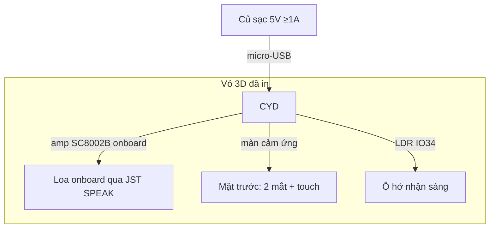

# Phase 07 — Lắp vào vỏ 3D đã in: cố định CYD, gắn loa, đi dây, chống chạm chập

## 1. Context links
- Plan cha: [plan.md](./plan.md) | Trước: [phase-06](./phase-06-tuong-tac-cam-ung-xpt2046-quang-tro-ldr.md)
- Dependencies: **cần P2..P6 chạy ổn** (lắp ráp cuối cùng).
- Liên quan: đo vỏ 3D ở [phase-01](./phase-01-chuan-bi-verify-a2dp-mua-linh-kien-cai-ide.md) (mục B).

## 2. Overview
- **Date:** 2026-07-10
- **Mô tả:** Gói tất cả vào **vỏ 3D user đã in sẵn (0đ)**: cố định board CYD, cắm loa onboard vào cổng JST "SPEAK", để lộ màn cảm ứng + LDR + cổng USB, chống chạm chập. **KHÔNG có module audio ngoài ở v1** (không hàn). **v1 chạy nguồn USB 5V** (củ sạc + cáp micro-USB user đã có). Pin 18650 là mục "nâng cấp tuỳ chọn" cuối file.
- **Priority:** P1 (thành phẩm)
- **Implementation status:** pending
- **Review status:** chưa review

## 3. Key Insights
- Vỏ đã có → công việc là **cơ khí + đi dây**, không thiết kế lại vỏ. Nếu P1 đo thấy không vừa → phải xử lý (khoét/in lại) TRƯỚC phase này.
- Người mới, không hàn → cố định bằng **vít nhựa/keo nến/băng dính 2 mặt/ốc đồng M3**; **loa cắm thẳng giắc JST vào cổng "SPEAK"** trên CYD (không hàn, không dây rời).
- **Chống chạm chập:** dây/giắc dễ tuột trong hộp kín → dùng băng cách điện/keo nến cố định; tránh chân kim loại chạm nhau.
- **Sụt áp (tuỳ chọn):** CYD (BT) + màn + amp cùng chạy → dòng peak có thể gây reset. Dùng củ sạc 5V ≥ 1A. Nếu vẫn reset khi nhạc to → gắn **tụ 1000µF ngang 5V–GND ở cổng USB/P1** (nhưng phải HÀN vào chân nguồn → chỉ làm nếu cần; ưu tiên đổi củ sạc trước).
- LDR + màn cảm ứng phải **lộ ra ngoài** (LDR cần thấy sáng; màn cần chạm được). Loa hướng ra trước, khoét lỗ thoát âm.

## 4. Requirements
**Functional**
- Robot đứng vững, màn hiện mắt, loa kêu, chạm/che sáng phản ứng — tất cả khi đã đóng vỏ.
- Cắm USB là chạy; tháo lắp bảo trì được (không keo chết board).
**Non-functional**
- Không chạm chập, không sụt áp gây reset khi bật nhạc to. Dây gọn, không kẹt màn.

## 5. Architecture (bố trí vật lý + nguồn)

- Mặt trước: màn (mắt + chạm). Ô nhỏ hở cho LDR. Lỗ loa. Bên hông: khe cáp USB.

## 6. Related code files
- Không tạo code mới. Có thể thêm `firmware/docs/so-do-lap-rap.md` (ảnh chụp bố trí + sơ đồ dây) để bảo trì.
- Firmware giữ nguyên P2-P6 (đảm bảo build 1 lần, nạp trước khi đóng vỏ).

## 7. Implementation Steps
1. **Nạp firmware final TRƯỚC khi đóng vỏ** (khó sửa sau khi đóng). Test chạy 10-15 phút.
2. Đặt CYD vào khoang, cố định 4 góc (ốc M3/keo nến/băng 2 mặt). Màn khớp ô cắt, không đè cạnh màn.
3. **Cắm loa vào cổng JST "SPEAK"** trên CYD (không hàn, không module ngoài). Cố định loa vào lỗ thoát âm (keo nến), hướng ra trước.
4. (Tuỳ chọn, chỉ nếu reset khi nhạc to) gắn tụ 1000µF ngang 5V–GND — bước này cần hàn vào chân nguồn, ưu tiên đổi củ sạc dòng cao trước.
5. Chừa **ô hở cho LDR** (không dán kín) + đảm bảo **màn cảm ứng lộ** để chạm.
6. Bó dây gọn bằng dây rút/băng; cách điện mối nối hở; kiểm không có chân kim loại chạm nhau.
7. Luồn cáp USB ra khe hông. Đóng vỏ.
8. **Test sau đóng vỏ:** cắm USB → mắt hiện, blink; pair "EMO-Robot" phát nhạc to → không reset/sụt áp; chạm màn (khi đang phát nhạc) + che LDR phản ứng đúng; nghe rè không.
9. Nếu reset khi nhạc to → đổi củ sạc dòng cao hơn / giảm gain (tụ là bước cuối vì cần hàn).

## 8. Todo list
- [ ] Nạp + test firmware final trước khi đóng vỏ
- [ ] Cố định CYD, khớp màn vào ô cắt
- [ ] Cắm loa vào cổng JST SPEAK, cố định vào lỗ thoát âm
- [ ] Chừa ô LDR + màn cảm ứng lộ; khoét lỗ loa
- [ ] Bó dây, cách điện, chống chạm chập
- [ ] Test sau đóng vỏ (nhạc to không reset, tương tác OK)

## 9. Success Criteria
- Cắm USB → robot chạy đầy đủ (mắt + loa + tương tác) trong vỏ kín, đứng vững.
- Bật nhạc to 5 phút không reset/sụt áp; không rè bất thường.
- Tháo lắp bảo trì được; không chạm chập.

## 10. Risk Assessment
| Rủi ro | Ảnh hưởng | Giảm thiểu |
|--------|-----------|-----------|
| CYD không vừa vỏ | Không đóng được | Đã đo P1; khoét/in lại trước |
| Chạm chập trong hộp kín | Cháy/reset | Cách điện mối nối, cố định dây |
| Sụt áp khi nhạc to | Reset liên tục | Củ sạc ≥1A trước; giảm gain; tụ 1000µF (cần hàn) là bước cuối |
| Cảm ứng chết khi phát nhạc | Mất chạm | DAC chỉ bật GPIO26 (P3/P4); test chạm khi phát nhạc |
| Dán keo chết board | Không bảo trì | Dùng ốc/băng 2 mặt tháo được |
| LDR/màn bị vỏ che | Mất tương tác | Chừa ô hở + màn lộ ra |

## 11. Security Considerations
- An toàn điện (không phải an ninh mạng): dùng củ sạc đạt chuẩn; không để dây trần chạm nhau; tụ đúng cực. Robot để bàn, nguồn 5V USB → rủi ro điện thấp nhưng vẫn cẩn thận chập.
- Bảo mật BT giữ như P4 (ai cũng pair được) — không đổi ở phase lắp ráp.

## 12. Next steps
- Hoàn tất v1. Nếu muốn di động → làm mục "Nâng cấp tuỳ chọn: pin" bên dưới.
- Nếu P1 verify A2DP FAIL → tích hợp P8 (Wi-Fi/PWA) trước khi đóng vỏ.

### Nâng cấp tuỳ chọn: pin 18650 (KHÔNG nằm trong v1)
- Sơ đồ: 18650 → **TP4056 (sạc + bảo vệ)** → **boost MT3608 lên 5V** → chân 5V CYD.
- **⚠️ Cảnh báo dòng peak:** CYD(BT) + màn + amp có thể vọt >500mA; MT3608 phải đủ dòng (≥1A), giữ tụ 1000µF. Pin yếu → brownout/reset khi nhạc to.
- **⚠️ An toàn 18650:** dùng cell có bảo vệ, không sạc-xả quá mức, không để chập; TP4056 loại có mạch bảo vệ. Người mới nên cân nhắc dùng **power bank** thay cụm pin tự ráp (an toàn hơn, KISS).

## Câu hỏi chưa giải đáp
- Kích thước khoang vỏ thực tế + có sẵn lỗ loa/ô LDR chưa? → cần user xác nhận sau khi đo P1.
- Loa gắn kiểu gì vào vỏ (khung có sẵn hay tự chế)?
