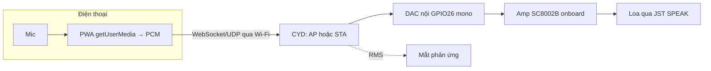

# Phase 08 (Optional) — Fallback Wi-Fi UDP/WebSocket + PWA nếu A2DP mic-through fail

## 1. Context links
- Plan cha: [plan.md](./plan.md) | Thay thế: [phase-04](./phase-04-bluetooth-a2dp-sink-nhan-audio-dien-thoai.md)
- **CHỈ làm phase này nếu P1 verify mic-to-speaker FAIL** (thường iOS không route mic→loa BT).
- Dependencies: cần P2 (mắt) + P3 (loa onboard + DAC nội). KHÔNG dùng chung lúc với A2DP.
- Research: [researcher-02](./research/researcher-02-audio-phone-streaming.md) (mục Wi-Fi WebSocket + PWA)

## 2. Overview
- **Date:** 2026-07-10
- **Mô tả:** Nếu đường A2DP không truyền được giọng, dùng **Wi-Fi**: 1 **PWA (web app)** trên điện thoại lấy mic (getUserMedia) → gửi PCM qua **WebSocket/UDP** tới ESP32 (CYD làm Access Point hoặc cùng LAN) → phát ra DAC nội/loa onboard. Không cần app store.
- **Priority:** P3 (chỉ khi cần)
- **Implementation status:** pending (conditional)
- **Review status:** chưa review

## 3. Key Insights
- **PWA chạy mọi điện thoại** (iOS Safari + Android Chrome), không publish store. `getUserMedia` lấy mic; `AudioContext`/`ScriptProcessor`/`AudioWorklet` lấy PCM.
- **iOS:** getUserMedia chỉ chạy trên **HTTPS** hoặc `localhost`. ESP32 tự ký cert phiền → cách thực dụng: chạy PWA từ **1 trang HTTPS** (GitHub Pages) rồi WebSocket tới ESP32 (ws://) — nhưng trang HTTPS gọi ws:// (mixed content) bị chặn. → Đơn giản nhất cho v1: **Android** (cho phép ws:// + getUserMedia trên http LAN dễ hơn) hoặc dùng ESP32 làm AP + trang http. **Ghi rõ iOS có thể vẫn vướng** — cần test.
- **WROOM không PSRAM** → buffer audio nhỏ; dùng UDP (nhẹ, chấp nhận mất gói) hoặc WebSocket. RMS lip-sync (P5) áp dụng tương tự trên PCM nhận được.
- **Không dùng đồng thời Wi-Fi + A2DP** (coexistence). Đây là chế độ THAY THẾ A2DP.
- Đây là hướng phức tạp hơn A2DP nhiều → chỉ làm khi buộc phải.

## 4. Requirements
**Functional**
- PWA lấy mic điện thoại → stream tới CYD → phát ra loa (voice-through) độ trễ chấp nhận.
- Mắt phản ứng âm lượng (dùng lại RMS P5 trên PCM Wi-Fi).
**Non-functional**
- Latency mục tiêu 100-200ms. Wi-Fi tắt khi không dùng (nếu quay lại A2DP). Không blocking.

## 5. Architecture


## 6. Related code files
- **Tạo:** `firmware/src/net/wifi-audio-receiver.h` / `.cpp` — Wi-Fi AP/STA + WebSocket/UDP server, nhận PCM → DAC nội (< 200 dòng).
- **Tạo:** `pwa/index.html`, `pwa/mic-streamer.js`, `pwa/manifest.webmanifest` — PWA lấy mic + gửi PCM (mỗi file < 200 dòng).
- **Sửa:** `firmware/platformio.ini` — thêm `ESPAsyncWebServer` + `AsyncTCP` (hoặc `arduinoWebSockets` của Links2004).
- **Sửa:** `firmware/src/main.cpp` — chế độ Wi-Fi (loại trừ A2DP).

## 7. Implementation Steps
1. **Chọn topo mạng:** đơn giản nhất = **CYD làm Access Point** (`WiFi.softAP("EMO-Robot","password")`), điện thoại nối AP đó → truy cập `http://192.168.4.1`.
2. **Firmware phục vụ PWA + WebSocket:** dùng `arduinoWebSockets` (Links2004) hoặc ESPAsyncWebServer. Nhận binary PCM 16-bit, đẩy ra **DAC nội GPIO26 mono** (`AnalogAudioStream`/`i2s` built-in DAC) — dùng lại cấu hình audio P3, chỉ bật kênh GPIO26 (tránh GPIO25 cảm ứng).
3. **PWA `mic-streamer.js`:**
```js
const ws = new WebSocket(`ws://${location.host}/ws`);
const ctx = new AudioContext({ sampleRate: 16000 });
const stream = await navigator.mediaDevices.getUserMedia({ audio: true });
const src = ctx.createMediaStreamSource(stream);
const node = ctx.createScriptProcessor(1024, 1, 0);   // (AudioWorklet nếu muốn hiện đại)
src.connect(node); node.connect(ctx.destination);
node.onaudioprocess = e => {
  const f32 = e.inputBuffer.getChannelData(0);
  const i16 = Int16Array.from(f32, x => Math.max(-1,Math.min(1,x))*32767);
  if (ws.readyState === 1) ws.send(i16.buffer);
};
```
4. **Buffer/latency:** ESP32 giữ buffer nhỏ (jitter buffer ~50-100ms) trước khi phát để chống giật.
5. **RMS lip-sync:** tính RMS ngay khi nhận PCM (giống P5) → cập nhật `g_audioLevel`.
6. **Test:** Android trước (dễ). iOS: nếu mixed-content/HTTPS chặn → thử ESP32 AP + http, hoặc chấp nhận Android-only cho v1, ghi rõ hạn chế.

## 8. Todo list
- [ ] Quyết topo: CYD làm AP (khuyến nghị)
- [ ] Firmware: Wi-Fi AP + WebSocket nhận PCM → DAC nội GPIO26 (dùng lại cấu hình P3)
- [ ] PWA: getUserMedia → PCM → WebSocket (index.html + mic-streamer.js + manifest)
- [ ] Jitter buffer chống giật
- [ ] RMS lip-sync trên PCM Wi-Fi (dùng lại P5)
- [ ] Test Android; kiểm tra iOS (ghi hạn chế nếu vướng HTTPS)

## 9. Success Criteria
- Điện thoại nối AP "EMO-Robot", mở PWA, nói vào mic → nghe ra loa robot, trễ 100-200ms.
- Mắt phản ứng âm lượng.
- Ghi rõ nền tảng nào chạy được (Android chắc chắn; iOS tuỳ HTTPS).

## 10. Risk Assessment
| Rủi ro | Ảnh hưởng | Giảm thiểu |
|--------|-----------|-----------|
| iOS chặn getUserMedia (không HTTPS) / mixed content | iOS không chạy | Test sớm; AP+http; hoặc Android-only v1 |
| WROOM ít RAM cho buffer + Wi-Fi | Giật/crash | Buffer nhỏ, UDP, sprite mắt nhỏ (P2) |
| Latency/jitter Wi-Fi | Tiếng giật | Jitter buffer 50-100ms |
| Wi-Fi + (lỡ bật) BT | Nhiễu radio | Chỉ 1 chế độ; tắt cái kia |
| Phức tạp vượt sức người mới | Bỏ dở | Chỉ làm khi A2DP thật sự fail; cân nhắc nhờ hỗ trợ |

## 11. Security Considerations
- **CYD làm AP nên đặt mật khẩu WPA2** (khác A2DP không auth). Ai biết pass mới nối được → an toàn hơn A2DP một chút.
- getUserMedia yêu cầu người dùng cấp quyền mic trên trình duyệt → minh bạch.
- Không lưu/tuồn audio ra internet (chỉ LAN nội bộ AP). Không mở port ra ngoài.

## 12. Next steps
- Nếu P8 chạy tốt → dùng thay P4, tích hợp vào P7 (lắp vỏ). Firmware để 2 chế độ (A2DP / Wi-Fi) chọn lúc khởi động, KHÔNG chạy song song.
- Nếu cả A2DP lẫn Wi-Fi đều khó → cân nhắc phương án C (TTS) hoặc nhờ hỗ trợ thêm.

## Câu hỏi chưa giải đáp
- Điện thoại chính của user là iOS hay Android? (quyết định độ khả thi PWA mic).
- Chấp nhận Android-only cho v1 nếu iOS vướng HTTPS không?
- Có cần voice-through 2 chiều hay chỉ 1 chiều (điện thoại → robot)? (hiện thiết kế 1 chiều).
