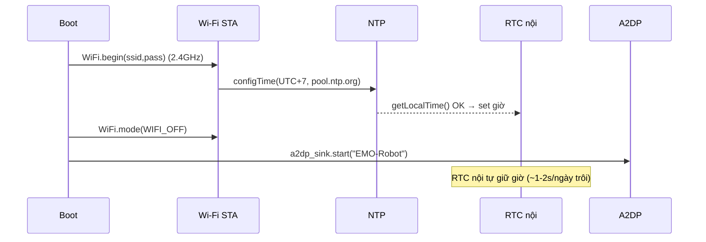
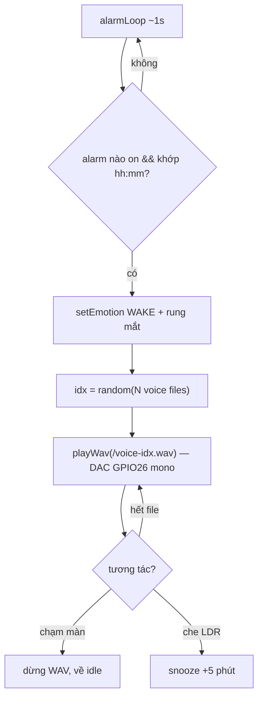

# Phase 09 — Báo thức: đồng hồ NTP + NHIỀU báo thức + mắt "wake" + GIỌNG NÓI nhắc nhở (WAV thu sẵn, phát ngẫu nhiên)

## 1. Context links
- Plan cha: [plan.md](./plan.md)
- Dependencies: **cần P2 (mắt/state machine) + P3 (âm thanh DAC nội) + P6 (cảm ứng XPT2046 + LDR)**. Độc lập P4 (A2DP) trừ mục mux audio (§7-E).
- Liên quan: cảnh báo GPIO25/DAC ở [phase-03](./phase-03-am-thanh-loa-onboard-dac-noi-phat-wav.md), [phase-06](./phase-06-tuong-tac-cam-ung-xpt2046-quang-tro-ldr.md).
- Tài liệu: Arduino `configTime`/`getLocalTime`, `Preferences` (NVS), ESP32 Wi-Fi (STA).

## 2. Overview
- **Date:** 2026-07-10
- **Mô tả:** Robot thành đồng hồ báo thức. Lấy giờ qua **NTP (Wi-Fi) MỘT LẦN lúc boot**, rồi tắt Wi-Fi để không đụng A2DP; ESP32 tự giữ giờ bằng RTC nội khi còn điện. Đặt/xoá **NHIỀU báo thức** bằng **cảm ứng** (màn danh sách), snooze bằng **LDR** (0 chân thêm). Tới giờ: mắt "wake/excited" + phát **giọng nói nhắc nhở** = 1 trong vài file WAV **user tự thu** chọn NGẪU NHIÊN (không phải chuông đơn điệu).
- **Priority:** P2
- **Implementation status:** pending
- **Review status:** chưa review
- **KHÔNG cần mua thêm linh kiện — báo thức = 0đ thêm.**

## 3. Key Insights
- **Xử lý xung đột Wi-Fi vs A2DP:** plan đã chốt "tắt Wi-Fi khi A2DP" (coexistence 2.4GHz làm tụt BT). → **sync NTP TRƯỚC `a2dp_sink.start()`**, xong `WiFi.mode(WIFI_OFF)` rồi mới bật A2DP. Robot cắm USB chạy liên tục → chỉ cần sync 1 lần lúc boot.
- **Độ chính xác:** thạch anh ESP32 ~10-20ppm ≈ **1-2 giây/ngày** trôi → thừa cho báo thức. Mất điện → mất giờ → tự sync lại lúc boot (chấp nhận được).
- **⚠️ ESP32 CHỈ bắt Wi-Fi 2.4GHz** (không 5GHz). Nếu router chỉ phát 5GHz → không sync được giờ. Bẫy phổ biến — hỏi user (§Câu hỏi).
- **⚠️ GPIO25 vẫn áp dụng:** WAV báo thức phát qua **DAC nội GPIO26 mono (DAC2-only)** như P3, KHÔNG bật GPIO25 (kẻo chết cảm ứng dùng để tắt báo thức).
- **NHIỀU báo thức (chốt với user):** lưu **mảng cố định `MAX_ALARMS = 4`** (đủ dùng, giữ UI cảm ứng đơn giản — YAGNI, không cấp phát động). Mỗi báo thức = `{uint8 h, uint8 m, bool on}`. Lưu cả mảng vào NVS bằng `putBytes` (1 key duy nhất). v1 **KHÔNG lặp theo thứ trong tuần** (user không yêu cầu) — kêu mỗi ngày; nếu sau muốn thì thêm `uint8 daysMask` (§12).
- **GIỌNG NÓI NGẪU NHIÊN (chốt với user):** để **nhiều file `/voice-1.wav … /voice-N.wav`** trên LittleFS. Tới giờ → `random(N)` chọn 1 file → `playWav`. Phải `randomSeed(micros() ^ analogRead(34))` một lần lúc boot kẻo lần nào cũng ra cùng câu. Đây chỉ là **đổi nguồn file WAV**, KHÔNG đổi đường tín hiệu DAC của P3 → gần như không thêm rủi ro phần cứng.
- **⚠️ ESP32 KHÔNG chạy TTS trên máy** (DAC 8-bit, không CPU/RAM cho tổng hợp giọng tiếng Việt). → "giọng nói" = **file thu SẴN**, không sinh giọng lúc chạy. Đây là ràng buộc, không phải lười.
- **Thu giọng → WAV chuẩn (chốt: user tự thu):** user thu bằng điện thoại (ghi âm) → ra `.m4a/.mp3` → convert `.wav` **PCM 16-bit mono 16000Hz** như P3. Lệnh: `ffmpeg -i in.m4a -ac 1 -ar 16000 -sample_fmt s16 -acodec pcm_s16le voice-1.wav`. Giữ mỗi câu **ngắn ~2-4s** (16kHz mono 16-bit = 32KB/giây → 4 file × 3s ≈ 384KB, vừa LittleFS; đừng để phình quá phân vùng ~1MB).
- **Lưu cấu hình vào NVS (`Preferences`)** → không mất khi reboot.
- **KHÔNG dùng RTC DS3231 ở v1 (YAGNI).** Chỉ cần khi muốn giữ giờ lúc mất điện/không Wi-Fi (mục nâng cấp §12).
- Wi-Fi SSID/mật khẩu: **hardcode ở v1** (WiFiManager là over-engineer cho người mới). **KHÔNG commit mật khẩu lên git.**

## 4. Requirements
**Functional**
- Boot: sync NTP (nếu có Wi-Fi) → giữ giờ bằng RTC nội.
- **Đặt/xoá NHIỀU báo thức (tối đa 4)** bằng cảm ứng: màn danh sách, chọn slot, +/- giờ, +/- phút, bật/tắt từng cái. Lưu cả mảng NVS.
- Tới giờ (báo thức nào đang bật): mắt "wake" (mở to + rung) + phát **1 file giọng nói NGẪU NHIÊN** trong `/voice-*.wav`.
- Tắt = chạm màn; snooze = che LDR (+5 phút).
- Idle lâu → chế độ hiển thị đồng hồ (giờ ở giữa màn) + báo thức gần nhất.
**Non-functional**
- Không blocking. WAV không chiếm GPIO25. Sync boot thêm ~2-5s (chấp nhận). Module alarm-manager < 150 dòng, UI cảm ứng < 200 dòng.

## 5. Architecture

**Trình tự boot (giải xung đột Wi-Fi/A2DP):**


**Luồng báo thức:** loop mỗi ~1s, duyệt mảng `alarms[]`; nếu có cái `on` khớp hh:mm hiện tại → trigger (mắt WAKE + phát `voice-random`) → chạm = tắt / che LDR = snooze +5'.



**DS3231 (chỉ nếu nâng cấp) — I2C trên CN1 (PicoBlade 4-pin):** SDA=IO22, SCL=IO27, VCC=3.3V, GND. Cần dây JST 1.25 4-pin.

## 6. Related code files
- **Tạo:** `firmware/src/time/ntp-time-sync.h` / `.cpp` — Wi-Fi STA + `configTime` + `getLocalTime` (< 100 dòng).
- **Tạo:** `firmware/src/alarm/alarm-manager.h` / `.cpp` — mảng `alarms[MAX_ALARMS]`, lưu/đọc NVS (`putBytes`), check trigger, snooze, chọn voice ngẫu nhiên (< 150 dòng).
- **Tạo:** `firmware/src/alarm/alarm-ui-touch.cpp` — màn danh sách + đặt/xoá nhiều báo thức bằng cảm ứng (dùng lại XPT2046 P6) (< 200 dòng).
- **Tạo:** `firmware/data/voice-1.wav … voice-N.wav` — các câu **giọng nói user tự thu** (16-bit mono 16kHz, mỗi câu 2-4s). Đặt tên đánh số liên tiếp từ 1.
- **Tạo:** `firmware/src/config/wifi-credentials.h` — SSID/pass (**thêm vào `.gitignore`, KHÔNG commit**).
- **Sửa:** `firmware/src/display/robo-eyes-tft.cpp` — thêm emotion `WAKE` + chế độ hiển thị giờ.
- **Sửa:** `firmware/src/main.cpp` — trình tự boot NTP → WiFi off → A2DP; gọi `alarmLoop()`.

## 7. Implementation Steps

**A. Sync giờ NTP lúc boot**
1. `ntp-time-sync.cpp`:
```cpp
#include <WiFi.h>
#include "config/wifi-credentials.h"   // #define WIFI_SSID / WIFI_PASS
bool syncTimeOnce(){
  WiFi.mode(WIFI_STA); WiFi.begin(WIFI_SSID, WIFI_PASS);
  for (int i=0; i<20 && WiFi.status()!=WL_CONNECTED; i++) delay(250); // chờ ~5s
  if (WiFi.status()!=WL_CONNECTED){ WiFi.mode(WIFI_OFF); return false; }
  configTime(7*3600, 0, "pool.ntp.org");   // UTC+7 Asia/Saigon
  struct tm t; bool ok = getLocalTime(&t, 5000);
  WiFi.mode(WIFI_OFF);                       // TẮT trước khi A2DP
  return ok;
}
```
2. `main.cpp` setup: `syncTimeOnce();` **rồi mới** `beginA2DP("EMO-Robot");`. Nếu sync fail → vẫn chạy, chỉ không có giờ đúng (báo mắt "confused" 1 lần).

**B. Lưu/đọc NHIỀU báo thức (NVS, mảng cố định)**
3. `alarm-manager.cpp` — mảng cố định, lưu cả cụm bằng `putBytes` (1 key):
```cpp
#include <Preferences.h>
#define MAX_ALARMS 4
struct Alarm { uint8_t h, m; bool on; };
Preferences pref; static Alarm alarms[MAX_ALARMS];
void loadAlarms(){
  pref.begin("alarm", true);
  if (pref.getBytesLength("arr") == sizeof(alarms))
    pref.getBytes("arr", alarms, sizeof(alarms));
  else for (int i=0;i<MAX_ALARMS;i++) alarms[i] = {7,0,false}; // mặc định
  pref.end();
}
void saveAlarms(){ pref.begin("alarm", false); pref.putBytes("arr", alarms, sizeof(alarms)); pref.end(); }
```

**C. Check trigger (non-blocking, duyệt mảng)**
4. `alarmLoop()` mỗi ~1s: `getLocalTime(&t)`; duyệt `i=0..MAX_ALARMS`, nếu `alarms[i].on && t.tm_hour==alarms[i].h && t.tm_min==alarms[i].m && t.tm_sec<2 && !fired` → `triggerAlarm()`; cờ `fired` reset khi sang phút (tránh kêu lặp trong cùng 1 phút).

**D. Trigger + GIỌNG NÓI ngẫu nhiên + tắt/snooze**
5. Đếm số file voice lúc boot (mở LittleFS, đếm `/voice-1.wav`, `/voice-2.wav`… tới file đầu tiên không tồn tại → `voiceCount`). `randomSeed(micros() ^ analogRead(34));` một lần trong setup.
6. `triggerAlarm()`: `setEmotion(WAKE)` (mắt mở to + rung nhẹ); chọn ngẫu nhiên rồi phát:
```cpp
void triggerAlarm(){
  setEmotion(WAKE);
  char path[20];
  int idx = (voiceCount > 0) ? (int)random(voiceCount) + 1 : 1;
  snprintf(path, sizeof(path), "/voice-%d.wav", idx);
  playWav(path);                 // DAC GPIO26 mono — P3, KHÔNG chiếm GPIO25
}
```
7. **Tắt = chạm màn** (đọc XPT2046 P6): dừng WAV, về idle. **Snooze = che LDR** (P6): hoãn +5 phút (đặt tạm 1 báo thức "một lần" sau 5').

**E. UI cảm ứng đặt/xoá NHIỀU báo thức**
8. `alarm-ui-touch.cpp` — màn "Settings" mở khi chạm giữ 2s ở chế độ đồng hồ:
   - Vẽ **danh sách 4 dòng**: `1  06:30  [ON]`, `2  --:--  [OFF]`… (drawString từng dòng).
   - Chạm 1 dòng = chọn slot đó → hiện nút **[+h][-h] [+m][-m] [BẬT/TẮT] [XOÁ]** (vùng chạm chia ô, map toạ độ XPT2046 P6).
   - Chạm **[Lưu]** = `saveAlarms()` → về đồng hồ. KISS: nút to, ít ô, không bàn phím.

**F. Mux audio khi đang A2DP (điểm CẦN TEST)**
9. Nếu đang stream A2DP mà tới giờ: `a2dp_sink.pause()` (hoặc ngắt output) → phát `voice-*.wav` → xong `a2dp_sink.play()` resume. **Lưu ý:** A2DP và WAV cùng dùng I2S0 built-in DAC → có thể tranh chấp peripheral; phải test thực tế, nếu lỗi thì stop hẳn A2DP output trước khi phát WAV.

**G. Chế độ hiển thị đồng hồ**
10. Khi idle > N giây: mắt thu nhỏ về góc + `tft.drawString(hh:mm)` giữa màn + dòng nhỏ "báo thức gần nhất: 06:30" (KISS). Chạm → về mắt thường; chạm giữ 2s → màn Settings (E).

**H. Thu + nạp file giọng nói (user tự thu)**
11. **Thu:** dùng app ghi âm điện thoại, thu vài câu ngắn 2-4s (VD: "Dậy đi nào!", "Tới giờ rồi, cố lên!", "Đừng ngủ nữa nha"). Gửi file `.m4a/.mp3` về máy tính.
12. **Convert sang WAV chuẩn** (cần cài `ffmpeg`), đặt tên đánh số liên tiếp từ 1:
```bash
ffmpeg -i cau1.m4a -ac 1 -ar 16000 -sample_fmt s16 -acodec pcm_s16le firmware/data/voice-1.wav
ffmpeg -i cau2.m4a -ac 1 -ar 16000 -sample_fmt s16 -acodec pcm_s16le firmware/data/voice-2.wav
# …voice-3.wav, voice-4.wav
```
   (Hoặc Audacity: Export → WAV → "Signed 16-bit PCM", Project Rate 16000, Tracks→Mix to Mono.)
13. PlatformIO → **Upload Filesystem Image** (nạp cả thư mục `data/` lên LittleFS như P3).

## 8. Todo list
- [ ] wifi-credentials.h (gitignore, không commit)
- [ ] ntp-time-sync: sync boot → WiFi off (thứ tự trước A2DP)
- [ ] alarm-manager: mảng MAX_ALARMS=4, lưu/đọc NVS (putBytes) + check trigger (duyệt mảng) + snooze
- [ ] Thu vài câu giọng → convert voice-1..N.wav (16-bit mono 16kHz) → upload LittleFS
- [ ] triggerAlarm: chọn voice NGẪU NHIÊN (randomSeed + random(voiceCount)); DAC GPIO26 mono
- [ ] emotion WAKE + rung mắt
- [ ] alarm-ui-touch: màn danh sách, đặt/xoá NHIỀU báo thức bằng cảm ứng
- [ ] Tắt = chạm; snooze = che LDR
- [ ] Mux A2DP khi tới giờ (TEST tranh chấp DAC)
- [ ] Chế độ hiển thị đồng hồ + báo thức gần nhất khi idle

## 9. Success Criteria
- Boot có Wi-Fi 2.4GHz → giờ đúng; sai lệch ≤ vài giây/ngày.
- **Đặt được nhiều báo thức (≥2), bật/tắt/xoá từng cái** bằng cảm ứng, lưu qua reboot (NVS).
- Tới giờ: mắt "wake" + **phát giọng nói user thu**, và **đổi câu ngẫu nhiên** giữa các lần kêu (không lặp cùng 1 câu liên tục).
- Chạm tắt được, che LDR snooze được.
- **Cảm ứng vẫn nhận khi WAV giọng nói đang kêu** (DAC không chiếm GPIO25).
- Khi đang A2DP mà tới giờ: báo thức chen được rồi resume (đã test).

## 10. Risk Assessment
| Rủi ro | Ảnh hưởng | Giảm thiểu |
|--------|-----------|-----------|
| Router chỉ 5GHz | Không sync giờ | Hỏi user; dùng SSID 2.4GHz; hoặc DS3231 (nâng cấp) |
| Mất điện → mất giờ | Báo sai giờ | Tự sync lại lúc boot; nâng cấp DS3231 nếu cần |
| WAV bật GPIO25 | Cảm ứng chết → không tắt được báo thức | DAC GPIO26 mono (P3); test chạm khi WAV kêu |
| File voice thu sai định dạng (không 16k mono s16) | Không phát / rè | Ép qua ffmpeg đúng lệnh §7-H; test phát từng file |
| Voice ngẫu nhiên luôn ra cùng câu | Kém sinh động | `randomSeed(micros()^analogRead(34))` 1 lần lúc boot |
| Nhiều file voice làm phình LittleFS | Upload FS lỗi/thiếu chỗ | Mỗi câu ≤4s, tổng ≤ ~500KB; tăng size phân vùng nếu cần |
| UI nhiều báo thức rối trên màn nhỏ | Khó đặt giờ | KISS: 4 slot, nút to, ít ô; không nhồi tính năng |
| A2DP + WAV tranh chấp I2S0 DAC | Lỗi/không phát báo thức | Pause A2DP trước; test thực tế |
| Bật Wi-Fi cùng A2DP (quên tắt) | Rè BT | WiFi.mode(WIFI_OFF) sau sync, trước A2DP |
| Trigger lặp trong 1 phút | Kêu liên tục | Cờ `fired` reset theo phút |
| Commit mật khẩu Wi-Fi | Lộ credential | wifi-credentials.h vào .gitignore |

## 11. Security Considerations
- **Mật khẩu Wi-Fi hardcode** → để trong `wifi-credentials.h`, **thêm `.gitignore`, KHÔNG commit** lên git (rule development-rules.md).
- NTP `pool.ntp.org` là dịch vụ công khai, không gửi dữ liệu cá nhân — chỉ lấy giờ. Wi-Fi chỉ bật ~5s lúc boot rồi tắt → bề mặt mạng rất nhỏ.
- Không mở port/nghe mạng ở chế độ báo thức.

## 12. Next steps
- Tích hợp vào P7 (đóng vỏ): đảm bảo màn cảm ứng lộ để đặt/tắt báo thức; LDR hở để snooze.
- (Tuỳ chọn) nếu cần giữ giờ khi mất điện/không Wi-Fi → gắn **DS3231 I2C** vào CN1 (SDA=IO22, SCL=IO27, 3.3V, GND), thư viện `RTClib`; mua DS3231 (~30-50k) + dây JST 1.25 4-pin (~15-30k).
- (Tuỳ chọn tương lai) **lặp theo thứ trong tuần**: thêm `uint8 daysMask` vào struct `Alarm` (bit 0=CN…6=T7), check `daysMask & (1<<t.tm_wday)`. Chưa làm ở v1 (user không yêu cầu — YAGNI).

## Câu hỏi chưa giải đáp
- **User có Wi-Fi 2.4GHz không?** (ESP32 KHÔNG bắt 5GHz — bẫy phổ biến). Router 2 băng tần có cho tách SSID 2.4GHz không? ⟵ **CÒN MỞ, cần trả lời trước khi làm P9.**
- ✅ ~~1 hay nhiều báo thức~~ → **CHỐT: nhiều (tối đa 4), không lặp theo thứ ở v1.**
- ✅ ~~Chuông hay giọng robot~~ → **CHỐT: giọng nói user TỰ THU, phát ngẫu nhiên giữa vài câu.**
- ✅ Hiển thị đồng hồ: **số ở giữa màn** (KISS) + báo thức gần nhất.
- Số câu giọng nói muốn thu (đề xuất 3-5 câu cho đủ đa dạng mà không phình LittleFS)?
