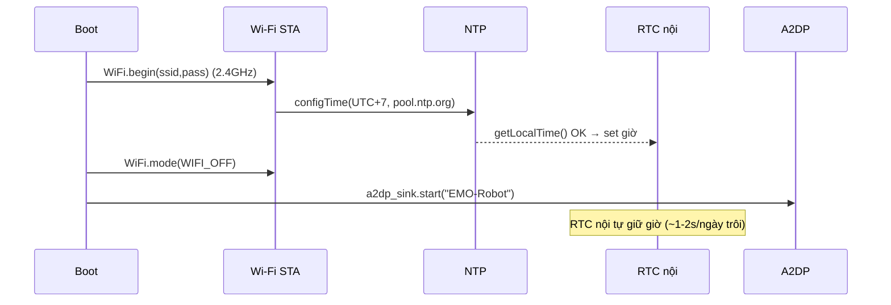

# Phase 09 — Báo thức: đồng hồ NTP (sync lúc boot) + mắt "wake" + WAV

## 1. Context links
- Plan cha: [plan.md](./plan.md)
- Dependencies: **cần P2 (mắt/state machine) + P3 (âm thanh DAC nội) + P6 (cảm ứng XPT2046 + LDR)**. Độc lập P4 (A2DP) trừ mục mux audio (§7-E).
- Liên quan: cảnh báo GPIO25/DAC ở [phase-03](./phase-03-am-thanh-loa-onboard-dac-noi-phat-wav.md), [phase-06](./phase-06-tuong-tac-cam-ung-xpt2046-quang-tro-ldr.md).
- Tài liệu: Arduino `configTime`/`getLocalTime`, `Preferences` (NVS), ESP32 Wi-Fi (STA).

## 2. Overview
- **Date:** 2026-07-10
- **Mô tả:** Robot thành đồng hồ báo thức. Lấy giờ qua **NTP (Wi-Fi) MỘT LẦN lúc boot**, rồi tắt Wi-Fi để không đụng A2DP; ESP32 tự giữ giờ bằng RTC nội khi còn điện. Đặt/tắt báo thức bằng **cảm ứng + LDR** (0 chân thêm). Tới giờ: mắt "wake/excited" + phát WAV báo thức.
- **Priority:** P2
- **Implementation status:** pending
- **Review status:** chưa review
- **KHÔNG cần mua thêm linh kiện — báo thức = 0đ thêm.**

## 3. Key Insights
- **Xử lý xung đột Wi-Fi vs A2DP:** plan đã chốt "tắt Wi-Fi khi A2DP" (coexistence 2.4GHz làm tụt BT). → **sync NTP TRƯỚC `a2dp_sink.start()`**, xong `WiFi.mode(WIFI_OFF)` rồi mới bật A2DP. Robot cắm USB chạy liên tục → chỉ cần sync 1 lần lúc boot.
- **Độ chính xác:** thạch anh ESP32 ~10-20ppm ≈ **1-2 giây/ngày** trôi → thừa cho báo thức. Mất điện → mất giờ → tự sync lại lúc boot (chấp nhận được).
- **⚠️ ESP32 CHỈ bắt Wi-Fi 2.4GHz** (không 5GHz). Nếu router chỉ phát 5GHz → không sync được giờ. Bẫy phổ biến — hỏi user (§Câu hỏi).
- **⚠️ GPIO25 vẫn áp dụng:** WAV báo thức phát qua **DAC nội GPIO26 mono (DAC2-only)** như P3, KHÔNG bật GPIO25 (kẻo chết cảm ứng dùng để tắt báo thức).
- **Lưu cấu hình vào NVS (`Preferences`)** → không mất khi reboot.
- **KHÔNG dùng RTC DS3231 ở v1 (YAGNI).** Chỉ cần khi muốn giữ giờ lúc mất điện/không Wi-Fi (mục nâng cấp §12).
- Wi-Fi SSID/mật khẩu: **hardcode ở v1** (WiFiManager là over-engineer cho người mới). **KHÔNG commit mật khẩu lên git.**

## 4. Requirements
**Functional**
- Boot: sync NTP (nếu có Wi-Fi) → giữ giờ bằng RTC nội.
- Đặt báo thức bằng cảm ứng (+giờ/+phút, chạm giữ = lưu). Lưu NVS.
- Tới giờ: mắt "wake" (mở to + rung) + phát WAV báo thức.
- Tắt = chạm màn; snooze = che LDR.
- Idle lâu → chế độ hiển thị đồng hồ (giờ ở giữa màn).
**Non-functional**
- Không blocking. WAV không chiếm GPIO25. Sync boot thêm ~2-5s (chấp nhận).

## 5. Architecture

**Trình tự boot (giải xung đột Wi-Fi/A2DP):**


**Luồng báo thức:** loop so `getLocalTime` hh:mm == alarm → trigger (mắt WAKE + WAV) → chạm = tắt / che LDR = snooze +5'.

**DS3231 (chỉ nếu nâng cấp) — I2C trên CN1 (PicoBlade 4-pin):** SDA=IO22, SCL=IO27, VCC=3.3V, GND. Cần dây JST 1.25 4-pin.

## 6. Related code files
- **Tạo:** `firmware/src/time/ntp-time-sync.h` / `.cpp` — Wi-Fi STA + `configTime` + `getLocalTime` (< 100 dòng).
- **Tạo:** `firmware/src/alarm/alarm-manager.h` / `.cpp` — lưu/đọc NVS, check trigger, snooze (< 150 dòng).
- **Tạo:** `firmware/src/alarm/alarm-ui-touch.cpp` — đặt giờ bằng cảm ứng (dùng lại XPT2046 P6).
- **Tạo:** `firmware/data/alarm.wav` — WAV báo thức (16-bit mono 16kHz).
- **Tạo:** `firmware/src/config/wifi-credentials.h` — SSID/pass (**thêm vào `.gitignore`, KHÔNG commit**).
- **Sửa:** `firmware/src/display/robo-eyes-tft.cpp` — thêm emotion `WAKE` + chế độ hiển thị giờ.
- **Sửa:** `firmware/src/main.cpp` — trình tự boot NTP → WiFi off → A2DP; gọi `alarmLoop()`.

## 7. Implementation Steps

**A. Sync giờ NTP lúc boot**
1. `ntp-time-sync.cpp`:
```cpp
#include <WiFi.h>
#include "config/wifi-credentials.h"   // #define WIFI_SSID / WIFI_PASS
bool syncTimeOnce(){
  WiFi.mode(WIFI_STA); WiFi.begin(WIFI_SSID, WIFI_PASS);
  for (int i=0; i<20 && WiFi.status()!=WL_CONNECTED; i++) delay(250); // chờ ~5s
  if (WiFi.status()!=WL_CONNECTED){ WiFi.mode(WIFI_OFF); return false; }
  configTime(7*3600, 0, "pool.ntp.org");   // UTC+7 Asia/Saigon
  struct tm t; bool ok = getLocalTime(&t, 5000);
  WiFi.mode(WIFI_OFF);                       // TẮT trước khi A2DP
  return ok;
}
```
2. `main.cpp` setup: `syncTimeOnce();` **rồi mới** `beginA2DP("EMO-Robot");`. Nếu sync fail → vẫn chạy, chỉ không có giờ đúng (báo mắt "confused" 1 lần).

**B. Lưu/đọc báo thức (NVS)**
3. `alarm-manager.cpp`:
```cpp
#include <Preferences.h>
Preferences pref; static int aH=7, aM=0; static bool aOn=false;
void loadAlarm(){ pref.begin("alarm", true); aH=pref.getInt("h",7); aM=pref.getInt("m",0); aOn=pref.getBool("on",false); pref.end(); }
void saveAlarm(){ pref.begin("alarm", false); pref.putInt("h",aH); pref.putInt("m",aM); pref.putBool("on",aOn); pref.end(); }
```

**C. Check trigger (non-blocking)**
4. `alarmLoop()` mỗi ~1s: `getLocalTime(&t)`; nếu `aOn && t.tm_hour==aH && t.tm_min==aM && t.tm_sec<2 && !fired` → `triggerAlarm()`; reset `fired` khi qua phút.

**D. Trigger + tắt/snooze**
5. `triggerAlarm()`: `setEmotion(WAKE)` (mắt mở to + rung nhẹ); `playWav("/alarm.wav")` (DAC GPIO26 mono — P3).
6. **Tắt = chạm màn** (đọc XPT2046 P6): dừng WAV, về idle. **Snooze = che LDR** (P6): hoãn +5 phút.

**E. Mux audio khi đang A2DP (điểm CẦN TEST)**
7. Nếu đang stream A2DP mà tới giờ: `a2dp_sink.pause()` (hoặc ngắt output) → phát `alarm.wav` → xong `a2dp_sink.play()` resume. **Lưu ý:** A2DP và WAV cùng dùng I2S0 built-in DAC → có thể tranh chấp peripheral; phải test thực tế, nếu lỗi thì stop hẳn A2DP output trước khi phát WAV.

**F. Chế độ hiển thị đồng hồ**
8. Khi idle > N giây: mắt thu nhỏ về góc + `tft.drawString(hh:mm)` giữa màn (KISS). Chạm → về mắt thường.

## 8. Todo list
- [ ] wifi-credentials.h (gitignore, không commit)
- [ ] ntp-time-sync: sync boot → WiFi off (thứ tự trước A2DP)
- [ ] alarm-manager: lưu/đọc NVS + check trigger + snooze
- [ ] alarm-ui-touch: đặt giờ bằng cảm ứng
- [ ] emotion WAKE + rung mắt; alarm.wav qua DAC GPIO26 mono
- [ ] Tắt = chạm; snooze = che LDR
- [ ] Mux A2DP khi tới giờ (TEST tranh chấp DAC)
- [ ] Chế độ hiển thị đồng hồ khi idle

## 9. Success Criteria
- Boot có Wi-Fi 2.4GHz → giờ đúng; sai lệch ≤ vài giây/ngày.
- Đặt báo thức bằng cảm ứng, lưu qua reboot (NVS).
- Tới giờ: mắt "wake" + WAV kêu; chạm tắt được, che LDR snooze được.
- **Cảm ứng vẫn nhận khi WAV báo thức đang kêu** (DAC không chiếm GPIO25).
- Khi đang A2DP mà tới giờ: báo thức chen được rồi resume (đã test).

## 10. Risk Assessment
| Rủi ro | Ảnh hưởng | Giảm thiểu |
|--------|-----------|-----------|
| Router chỉ 5GHz | Không sync giờ | Hỏi user; dùng SSID 2.4GHz; hoặc DS3231 (nâng cấp) |
| Mất điện → mất giờ | Báo sai giờ | Tự sync lại lúc boot; nâng cấp DS3231 nếu cần |
| WAV bật GPIO25 | Cảm ứng chết → không tắt được báo thức | DAC GPIO26 mono (P3); test chạm khi WAV kêu |
| A2DP + WAV tranh chấp I2S0 DAC | Lỗi/không phát báo thức | Pause A2DP trước; test thực tế |
| Bật Wi-Fi cùng A2DP (quên tắt) | Rè BT | WiFi.mode(WIFI_OFF) sau sync, trước A2DP |
| Trigger lặp trong 1 phút | Kêu liên tục | Cờ `fired` reset theo phút |
| Commit mật khẩu Wi-Fi | Lộ credential | wifi-credentials.h vào .gitignore |

## 11. Security Considerations
- **Mật khẩu Wi-Fi hardcode** → để trong `wifi-credentials.h`, **thêm `.gitignore`, KHÔNG commit** lên git (rule development-rules.md).
- NTP `pool.ntp.org` là dịch vụ công khai, không gửi dữ liệu cá nhân — chỉ lấy giờ. Wi-Fi chỉ bật ~5s lúc boot rồi tắt → bề mặt mạng rất nhỏ.
- Không mở port/nghe mạng ở chế độ báo thức.

## 12. Next steps
- Tích hợp vào P7 (đóng vỏ): đảm bảo màn cảm ứng lộ để đặt/tắt báo thức; LDR hở để snooze.
- (Tuỳ chọn) nếu cần giữ giờ khi mất điện/không Wi-Fi → gắn **DS3231 I2C** vào CN1 (SDA=IO22, SCL=IO27, 3.3V, GND), thư viện `RTClib`; mua DS3231 (~30-50k) + dây JST 1.25 4-pin (~15-30k).

## Câu hỏi chưa giải đáp
- **User có Wi-Fi 2.4GHz không?** (ESP32 KHÔNG bắt 5GHz — bẫy phổ biến). Router 2 băng tần có cho tách SSID 2.4GHz không?
- Muốn 1 báo thức hay nhiều (mỗi ngày/lặp lại)? v1 nên làm 1 báo thức đơn giản (YAGNI).
- WAV báo thức: dùng tiếng gì (chuông/giọng robot)? user cung cấp file.
- Hiển thị đồng hồ: số ở giữa màn hay "mắt biến thành số"? → chọn theo thẩm mỹ (v1 làm số cho đơn giản).
